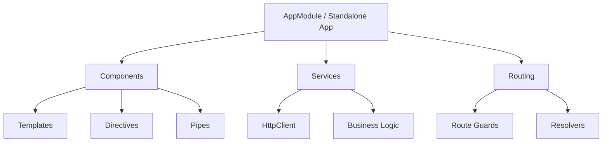

# Angular Interview Preparation Guide
## For Developers with 3 Years of Experience

> **Prepared by:** Senior Angular Architect & Technical Interviewer  
> **Target Level:** 3 Years Angular Experience | Mid-Senior Developer  
> **Last Updated:** 2025

---

## 📋 Table of Contents

1. [Angular Fundamentals](#1-angular-fundamentals)
2. [TypeScript](#2-typescript)
3. [Components & Templates](#3-components--templates)
4. [Directives](#4-directives)
5. [Pipes](#5-pipes)
6. [Services & Dependency Injection](#6-services--dependency-injection)
7. [RxJS](#7-rxjs-very-important)
8. [HTTP & APIs](#8-http--apis)
9. [Routing](#9-routing)
10. [Forms](#10-forms)
11. [State Management](#11-state-management)
12. [Performance Optimization](#12-performance-optimization)
13. [Testing](#13-testing)
14. [Angular Security](#14-angular-security)
15. [Angular 17+ / Latest Features](#15-angular-17--latest-features)
16. [Coding Questions](#16-coding-questions)
17. [Machine Coding Round](#17-machine-coding-round)
18. [Debugging Scenarios](#18-angular-debugging-scenarios)
19. [100 Real Interview Questions](#19-100-real-interview-questions)
20. [100 Scenario-Based Questions](#20-100-scenario-based-questions)

---

> 💡 **Interview Tips:**
> - Always explain the *why*, not just the *what*
> - Use real-world examples from your 3 years of experience
> - Mention trade-offs when discussing architectural decisions
> - Show awareness of Angular's latest features (Signals, Zoneless, etc.)
> - Admit what you don't know confidently and explain how you'd find out

---

## 1. Angular Fundamentals

### What is Angular?

**Beginner Question:** What is Angular and what makes it different from AngularJS?

**Answer:**
Angular is a TypeScript-based, open-source web application framework developed and maintained by Google. It is a complete rewrite of AngularJS (Angular 1.x) and was released in 2016 as Angular 2, with major versions released regularly since.

Key differences:
| Feature | AngularJS (1.x) | Angular (2+) |
|---|---|---|
| Language | JavaScript | TypeScript |
| Architecture | MVC | Component-based |
| Data Binding | Two-way ($scope) | Unidirectional + Two-way |
| Change Detection | Dirty Checking | Zone.js / Signals |
| Mobile Support | Limited | Full (Ionic, PWA) |
| Performance | Slower | Faster |

**Intermediate Question:** What are the core building blocks of an Angular application?

**Answer:**
```
Angular App
├── Modules (NgModule / Standalone)
├── Components (View + Logic)
├── Templates (HTML + Angular syntax)
├── Services (Business logic, DI)
├── Directives (DOM manipulation)
├── Pipes (Data transformation)
└── Routing (Navigation)
```

**Advanced Question:** Explain Angular's compilation process — JIT vs AOT.

**Answer:**
- **JIT (Just-in-Time):** Browser downloads Angular compiler and compiles app at runtime. Used in development.
- **AOT (Ahead-of-Time):** App is compiled during the build process (before browser downloads it). Used in production.

AOT benefits:
- Faster rendering (no compiler in bundle)
- Detect template errors at build time
- Smaller bundle size
- Better security (no eval at runtime)

```bash
# AOT is default in production builds
ng build --configuration production
```

---

### Angular Architecture

**Beginner Question:** Describe the Angular application architecture.

**Answer:**


Angular follows a **hierarchical component tree** pattern. Components form the UI, Services handle business logic and state, and the Dependency Injection system wires everything together.

**Intermediate Question:** What is the role of `NgModule`? Is it still required?

**Answer:**
`NgModule` was the traditional way to organize Angular apps into cohesive blocks of code. It declares components, imports other modules, exports components for use in other modules, and registers providers.

As of Angular 14+, **Standalone Components** make NgModule optional. Standalone components use `imports` directly on the component decorator, significantly simplifying the architecture.

```typescript
// Traditional NgModule approach
@NgModule({
  declarations: [AppComponent, UserComponent],
  imports: [BrowserModule, HttpClientModule],
  providers: [UserService],
  bootstrap: [AppComponent]
})
export class AppModule {}

// Modern Standalone approach (Angular 14+)
@Component({
  standalone: true,
  imports: [CommonModule, HttpClientModule],
  template: `<h1>Hello</h1>`
})
export class AppComponent {}
```

**Advanced Question:** Explain the Angular bootstrapping process step by step.

**Answer:**
1. Browser loads `index.html`
2. Angular CLI generates `main.ts` which calls `bootstrapApplication()` or `platformBrowserDynamic().bootstrapModule()`
3. Angular reads the bootstrap component/module
4. Angular initializes `Zone.js` (unless zoneless)
5. Component tree is rendered starting from root component
6. Change detection starts

```typescript
// Modern standalone bootstrapping (Angular 14+)
bootstrapApplication(AppComponent, {
  providers: [
    provideRouter(routes),
    provideHttpClient(),
    provideAnimations()
  ]
});
```

---

### SPA vs MPA

**Beginner Question:** What is an SPA? How does Angular implement it?

**Answer:**
- **SPA (Single-Page Application):** One HTML page, content changes dynamically via JavaScript. Navigation happens without full page reloads.
- **MPA (Multi-Page Application):** Each navigation request loads a full new HTML page from the server.

Angular implements SPA via the **Angular Router** — it intercepts navigation and renders different components based on the URL without reloading the page.

| Feature | SPA (Angular) | MPA |
|---|---|---|
| Initial Load | Slower (larger bundle) | Faster |
| Subsequent Navigation | Fast | Slow (full reload) |
| SEO | Needs SSR/prerendering | Good by default |
| UX | App-like, smooth | Traditional |

---

### Angular CLI

**Beginner Question:** What is Angular CLI and what are the most commonly used commands?

**Answer:**
Angular CLI (Command Line Interface) is a tool that automates Angular development tasks — creating projects, generating code, building, testing, and deploying.

```bash
# Install CLI
npm install -g @angular/cli

# Create new project
ng new my-app --standalone --routing --style=scss

# Generate artifacts
ng generate component user-list         # or ng g c user-list
ng generate service auth                # or ng g s auth
ng generate module admin --routing      # ng g m admin --routing
ng generate directive highlight         # ng g d highlight
ng generate pipe currency-format        # ng g p currency-format
ng generate guard auth                  # ng g guard auth
ng generate interceptor logging         # ng g interceptor logging

# Build
ng build                               # development
ng build --configuration production    # production (AOT + minification)

# Serve
ng serve                              # dev server, port 4200
ng serve --port 4300 --open

# Test
ng test                               # unit tests (Karma/Jest)
ng e2e                                # end-to-end tests

# Lint
ng lint
```

**Intermediate Question:** What is `angular.json` and what can you configure in it?

**Answer:**
`angular.json` is the workspace configuration file for Angular CLI projects. Key configurations include:

```json
{
  "projects": {
    "my-app": {
      "architect": {
        "build": {
          "options": {
            "outputPath": "dist/my-app",
            "index": "src/index.html",
            "main": "src/main.ts",
            "assets": ["src/favicon.ico", "src/assets"],
            "styles": ["src/styles.scss"],
            "scripts": [],
            "budgets": [
              { "type": "initial", "maximumWarning": "500kb", "maximumError": "1mb" }
            ]
          },
          "configurations": {
            "production": {
              "optimization": true,
              "outputHashing": "all",
              "sourceMap": false
            }
          }
        }
      }
    }
  }
}
```

---

### Components

**Beginner Question:** What is a component in Angular?

**Answer:**
A component is the fundamental building block of Angular applications. It controls a section of the UI (a view) and consists of:
- **TypeScript class** — data and logic
- **HTML template** — defines the view
- **CSS styles** — view-specific styles
- **Decorator** (`@Component`) — metadata

```typescript
@Component({
  selector: 'app-user-card',
  standalone: true,
  imports: [CommonModule],
  template: `
    <div class="card">
      <h2>{{ user.name }}</h2>
      <p>{{ user.email }}</p>
    </div>
  `,
  styles: [`
    .card { border: 1px solid #ccc; padding: 16px; }
  `]
})
export class UserCardComponent {
  @Input() user!: User;
}
```

**Intermediate Question:** What is the difference between `selector` types in Angular components?

**Answer:**
```typescript
// Element selector (most common)
@Component({ selector: 'app-user' })
// Usage: <app-user></app-user>

// Attribute selector
@Component({ selector: '[appUser]' })
// Usage: <div appUser></div>

// Class selector
@Component({ selector: '.app-user' })
// Usage: <div class="app-user"></div>
```

**Advanced Question:** Explain `ChangeDetectionStrategy.OnPush` and when to use it.

**Answer:**
By default, Angular runs change detection on every component in the tree on every event. `OnPush` tells Angular to only run change detection for a component when:
1. An `@Input()` reference changes
2. An event originates from the component or its children
3. An `async` pipe receives a new value
4. `ChangeDetectorRef.markForCheck()` is called manually
5. A Signal used in the template changes (Angular 16+)

```typescript
@Component({
  selector: 'app-user-list',
  changeDetection: ChangeDetectionStrategy.OnPush,
  template: `
    <div *ngFor="let user of users">{{ user.name }}</div>
  `
})
export class UserListComponent {
  @Input() users: User[] = [];

  constructor(private cdr: ChangeDetectorRef) {}

  // If you mutate state outside Angular's awareness
  loadMore(): void {
    this.users.push(newUser); // mutation won't trigger detection!
    this.cdr.markForCheck();  // need this
    // Better: this.users = [...this.users, newUser]; // new reference
  }
}
```

> ⚠️ **Common Mistake:** Mutating `@Input` arrays/objects with OnPush won't trigger re-render. Always create new references.

---

### Data Binding

**Beginner Question:** What are the four types of data binding in Angular?

**Answer:**
```typescript
@Component({
  template: `
    <!-- 1. Interpolation: Component → Template -->
    <h1>{{ title }}</h1>
    <p>{{ user.name | uppercase }}</p>

    <!-- 2. Property Binding: Component → Template -->
    
    <button [disabled]="isLoading">Submit</button>
    <app-child [data]="parentData"></app-child>

    <!-- 3. Event Binding: Template → Component -->
    <button (click)="onSave()">Save</button>
    <input (keyup.enter)="onEnter()">
    <app-child (selected)="onItemSelected($event)"></app-child>

    <!-- 4. Two-way Binding: Both directions -->
    <input [(ngModel)]="username">
    <!-- Equivalent to: -->
    <input [value]="username" (input)="username = $event.target.value">
  `
})
export class ExampleComponent {
  title = 'Hello World';
  imageUrl = '/assets/logo.png';
  isLoading = false;
  username = '';
}
```

**Intermediate Question:** What is the difference between `[attr.disabled]` and `[disabled]`?

**Answer:**
```html
<!-- Property binding — binds to the DOM property -->
<button [disabled]="isDisabled">Click</button>

<!-- Attribute binding — binds to the HTML attribute -->
<!-- Use when no DOM property counterpart exists -->
<td [attr.colspan]="colSpan">Cell</td>
<button [attr.aria-label]="buttonLabel">Icon</button>

<!-- Class binding -->
<div [class.active]="isActive">...</div>
<div [ngClass]="{'active': isActive, 'error': hasError}">...</div>

<!-- Style binding -->
<div [style.color]="textColor">...</div>
<div [ngStyle]="{'color': textColor, 'font-size': fontSize + 'px'}">...</div>
```

---

### Directives

*(See full Directives section below for detailed coverage)*

**Beginner Question:** What is the difference between a Component, Structural Directive, and Attribute Directive?

| Type | Purpose | Syntax | Example |
|---|---|---|---|
| Component | Creates view with template | `<app-xyz>` | `AppComponent` |
| Structural Directive | Changes DOM structure | `*directive` | `*ngIf`, `*ngFor` |
| Attribute Directive | Changes element appearance/behavior | `[directive]` | `[ngClass]`, `[highlight]` |

---

### Pipes

*(See full Pipes section below)*

**Beginner Question:** What is a pipe in Angular?

**Answer:** A pipe transforms data in templates. Syntax: `{{ value | pipeName:arg1:arg2 }}`

```html
{{ today | date:'dd/MM/yyyy' }}
{{ price | currency:'INR':'symbol':'1.2-2' }}
{{ name | uppercase }}
{{ longText | slice:0:100 }}
{{ data | json }}
{{ obs$ | async }}
```

---

### Angular Lifecycle Hooks

**Beginner Question:** List the Angular lifecycle hooks in order.

**Answer:**
```typescript
@Component({ selector: 'app-example', template: '' })
export class ExampleComponent implements
  OnChanges, OnInit, DoCheck,
  AfterContentInit, AfterContentChecked,
  AfterViewInit, AfterViewChecked, OnDestroy {

  // 1. Called when @Input properties change (before OnInit)
  ngOnChanges(changes: SimpleChanges): void {
    console.log('Input changed:', changes);
  }

  // 2. Called once after first ngOnChanges. Use for initialization.
  ngOnInit(): void {
    this.loadData(); // fetch data, set up subscriptions
  }

  // 3. Custom change detection (every CD cycle). Use sparingly — expensive!
  ngDoCheck(): void {}

  // 4. After <ng-content> is projected
  ngAfterContentInit(): void {}

  // 5. After every CD cycle for projected content
  ngAfterContentChecked(): void {}

  // 6. After component's view + child views are initialized
  ngAfterViewInit(): void {
    // Safe to use @ViewChild here
  }

  // 7. After every CD cycle for view + child views
  ngAfterViewChecked(): void {}

  // 8. Before component is destroyed
  ngOnDestroy(): void {
    this.subscription.unsubscribe(); // cleanup!
    this.destroy$.next(); this.destroy$.complete(); // takeUntil pattern
  }
}
```

**Intermediate Question:** When does `ngOnChanges` fire vs `ngOnInit`?

**Answer:**
- `ngOnChanges` fires **before** `ngOnInit` on the first run, and **after** every `@Input()` change thereafter
- `ngOnInit` fires **once** after the first `ngOnChanges`
- If a component has no `@Input()`, `ngOnChanges` never fires

**Advanced Question:** What is the `ngDoCheck` hook and what are its performance implications?

**Answer:**
`ngDoCheck` is called on every change detection cycle — it runs extremely frequently. It's used for custom change detection logic when Angular's default detection (reference checks) isn't sufficient, e.g., detecting mutations within objects/arrays.

```typescript
ngDoCheck(): void {
  // This runs on every mouse move, keypress, etc. — very expensive!
  if (this.users !== this.previousUsers) {
    this.previousUsers = this.users;
    // do something
  }
}
```

> ⚠️ **Performance Warning:** Avoid complex operations inside `ngDoCheck`. Consider using `IterableDiffers` or `KeyValueDiffers` for efficient change detection.

---

### Change Detection

**Intermediate Question:** How does Angular's change detection work?

**Answer:**
Angular uses **Zone.js** to patch browser async APIs (setTimeout, Promises, addEventListener, etc.). When any async operation completes, Zone.js notifies Angular, which then runs change detection on the entire component tree.

```mermaid
graph LR
    A[Async Event] --> B[Zone.js intercepts]
    B --> C[NgZone.onMicrotaskEmpty]
    C --> D[ApplicationRef.tick()]
    D --> E[Change Detection runs top-down]
    E --> F[DOM updated]
```

**Advanced Question:** Explain the difference between `Default` and `OnPush` change detection strategies.

**Answer:**
- **Default:** Angular checks every component in the tree on every CD cycle
- **OnPush:** Angular skips a component and its subtree unless specific conditions are met (see above)

**Tip for interviews:** "In large applications, using OnPush across all components dramatically reduces the number of checks, improving performance. I use OnPush as the default strategy in all my projects."

---

### Signals (Angular 16+)

**Intermediate Question:** What are Signals in Angular and how do they differ from traditional change detection?

**Answer:**
Signals are a reactive primitive introduced in Angular 16 (stable in 17). They represent a value that can change over time and automatically notify dependents when they change.

```typescript
import { signal, computed, effect } from '@angular/core';

@Component({
  template: `
    <p>Count: {{ count() }}</p>
    <p>Double: {{ doubled() }}</p>
    <button (click)="increment()">+1</button>
  `
})
export class CounterComponent {
  // Writable signal
  count = signal(0);

  // Computed signal — derived, read-only
  doubled = computed(() => this.count() * 2);

  constructor() {
    // Effect — runs when signal changes
    effect(() => {
      console.log(`Count changed to: ${this.count()}`);
    });
  }

  increment(): void {
    this.count.update(c => c + 1); // or this.count.set(this.count() + 1)
  }
}
```

**Advanced Question:** What is the difference between `signal.set()`, `signal.update()`, and `signal.mutate()`?

**Answer:**
```typescript
const count = signal(0);
const users = signal<User[]>([]);

// set() — replaces the value entirely
count.set(5);

// update() — transforms current value
count.update(c => c + 1);

// mutate() — mutates in place (deprecated in Angular 17, removed in 18)
// In Angular 17+, use update() with a new reference instead:
users.update(list => [...list, newUser]); // create new array
```

**Advanced Question:** When would you use Signals vs RxJS Observables?

**Answer:**
| Aspect             | Signals               | RxJS Observables        |
|--------------------|-----------------------|-------------------------|
| Synchronous        | Always synchronous    | Can be async            |
| Template usage     | `{{ count() }}`       | `{{ count$ \| async }}` |
| Complexity         | Simple                | Powerful for complex streams |
| HTTP/WebSockets    | Not designed for it   | Perfect                 |
| Local UI state     | Excellent             | Overkill                |
| Derived state      | `computed()`          | `combineLatest`, `map`  |

**Rule of thumb:** Use Signals for local component state and derived UI state. Use RxJS for async streams, HTTP, WebSockets, and complex event transformations. Use `toSignal()` and `toObservable()` to bridge the two.

---

### Zoneless Angular

**Advanced Question:** What is Zoneless Angular and why is it significant?

**Answer:**
Zoneless Angular (experimental in Angular 17, progressing in 18+) removes the dependency on Zone.js. Instead, change detection is triggered explicitly through:
- Signal changes
- `ChangeDetectorRef.markForCheck()`
- `ApplicationRef.tick()`

```typescript
// main.ts — enable zoneless
bootstrapApplication(AppComponent, {
  providers: [
    provideExperimentalZonelessChangeDetection()
  ]
});
```

Benefits:
- **Smaller bundle** (~100KB reduction — Zone.js removed)
- **Better performance** — CD only runs when actually needed
- **Better SSR/SSG compatibility**
- **Easier debugging** — no "black box" zone patches

---

### View Encapsulation

**Intermediate Question:** What are the three ViewEncapsulation strategies in Angular?

**Answer:**
```typescript
import { ViewEncapsulation } from '@angular/core';

// 1. Emulated (default) — Angular adds unique attributes to scope CSS
@Component({
  encapsulation: ViewEncapsulation.Emulated,
  styles: ['.card { color: red; }']
  // Becomes: .card[_ngcontent-abc-c123] { color: red; }
})

// 2. None — styles are global, no scoping
@Component({
  encapsulation: ViewEncapsulation.None,
  styles: ['.card { color: red; }'] // global!
})

// 3. ShadowDom — uses native browser Shadow DOM
@Component({
  encapsulation: ViewEncapsulation.ShadowDom,
  // True CSS isolation via Shadow DOM
})
```

> **Interview Tip:** "I use `Emulated` (default) most of the time. I use `None` for global styles or shared UI library components, and `ShadowDom` when building truly isolated web components."

---

## 2. TypeScript

### Types

**Beginner Question:** What are TypeScript's primitive types?

**Answer:**
```typescript
// Primitive types
let name: string = 'Angular';
let version: number = 17;
let isStable: boolean = true;
let notSure: any = 'anything';       // avoid in Angular
let nothing: void = undefined;
let nothingNull: null = null;
let notDefined: undefined = undefined;
let uniqueKey: symbol = Symbol('id');
let bigNum: bigint = 9007199254740992n;

// Never — function that never returns
function throwError(msg: string): never {
  throw new Error(msg);
}

// Unknown — safer than any
let input: unknown = getUserInput();
if (typeof input === 'string') {
  console.log(input.toUpperCase()); // safe after type guard
}
```

---

### Interfaces

**Intermediate Question:** What is an interface in TypeScript and how is it used in Angular?

**Answer:**
```typescript
// Basic interface
interface User {
  id: number;
  name: string;
  email: string;
  role?: 'admin' | 'user'; // optional
  readonly createdAt: Date; // read-only
}

// Interface extending another
interface AdminUser extends User {
  permissions: string[];
}

// Interface for function types
interface ApiService {
  getUser(id: number): Observable<User>;
  updateUser(id: number, data: Partial<User>): Observable<User>;
}

// Usage in Angular service
@Injectable({ providedIn: 'root' })
export class UserService implements ApiService {
  getUser(id: number): Observable<User> {
    return this.http.get<User>(`/api/users/${id}`);
  }
  updateUser(id: number, data: Partial<User>): Observable<User> {
    return this.http.patch<User>(`/api/users/${id}`, data);
  }
}
```

---

### Type Aliases

**Intermediate Question:** What is the difference between `interface` and `type` alias?

**Answer:**
```typescript
// Type alias — can represent primitives, unions, intersections
type UserId = number | string;
type Status = 'active' | 'inactive' | 'pending';
type UserWithRole = User & { role: string }; // intersection

// Interface — extendable, better for OOP
interface Shape { area(): number; }
interface Circle extends Shape { radius: number; }

// Key differences:
// 1. Type aliases can't be re-opened (augmented), interfaces can
interface Window { title: string; }
interface Window { ts: TypeScriptAPI; } // declaration merging — valid!

type Point = { x: number };
type Point = { y: number }; // ERROR — cannot redeclare

// 2. Better error messages with interfaces
// 3. Use interface for public API, type for complex type expressions

// In Angular: prefer interfaces for data models, types for union/utility types
type HttpMethod = 'GET' | 'POST' | 'PUT' | 'DELETE' | 'PATCH';
type ApiResponse<T> = { data: T; status: number; message: string };
```

---

### Enums

**Intermediate Question:** When would you use enums in Angular?

**Answer:**
```typescript
// Numeric enum (default)
enum Direction { Up, Down, Left, Right } // 0, 1, 2, 3

// String enum — more readable, safer
enum UserRole {
  Admin = 'ADMIN',
  User = 'USER',
  Guest = 'GUEST'
}

// Const enum — inlined at compile time, no runtime object
const enum HttpStatus {
  OK = 200,
  NotFound = 404,
  ServerError = 500
}

// Usage in Angular
@Component({ template: `
  <span [class]="role === UserRole.Admin ? 'admin-badge' : 'user-badge'">
    {{ role }}
  </span>
`})
export class RoleBadgeComponent {
  UserRole = UserRole; // expose enum to template
  @Input() role: UserRole = UserRole.User;
}
```

> **Note:** In modern Angular, `const` string union types (`type Role = 'ADMIN' | 'USER'`) are often preferred over enums due to simpler output and no runtime overhead.

---

### Generics

**Intermediate Question:** Explain generics in TypeScript with an Angular example.

**Answer:**
```typescript
// Generic service pattern — very common in Angular
@Injectable({ providedIn: 'root' })
export class CrudService<T extends { id: number }> {
  constructor(private http: HttpClient, private baseUrl: string) {}

  getAll(): Observable<T[]> {
    return this.http.get<T[]>(this.baseUrl);
  }

  getById(id: number): Observable<T> {
    return this.http.get<T>(`${this.baseUrl}/${id}`);
  }

  create(item: Omit<T, 'id'>): Observable<T> {
    return this.http.post<T>(this.baseUrl, item);
  }

  update(id: number, item: Partial<T>): Observable<T> {
    return this.http.put<T>(`${this.baseUrl}/${id}`, item);
  }

  delete(id: number): Observable<void> {
    return this.http.delete<void>(`${this.baseUrl}/${id}`);
  }
}

// Generic utility function
function groupBy<T, K extends keyof T>(array: T[], key: K): Map<T[K], T[]> {
  return array.reduce((map, item) => {
    const groupKey = item[key];
    const group = map.get(groupKey) ?? [];
    return map.set(groupKey, [...group, item]);
  }, new Map<T[K], T[]>());
}
```

---

### Decorators

**Advanced Question:** How do decorators work in TypeScript/Angular?

**Answer:**
Decorators are special declarations that modify classes, methods, properties, or parameters. In Angular, they are used extensively for metadata.

```typescript
// Class decorator
@Component({ selector: 'app-root', template: '' })
class AppComponent {} // @Component adds metadata to the class

// Property decorator
@Input() title: string = ''; // @Input marks as bindable from parent
@Output() clicked = new EventEmitter<void>(); // @Output marks as event emitter

// Parameter decorator
@Injectable()
class UserService {
  constructor(@Inject(HTTP_URL) private url: string) {} // @Inject for custom tokens
}

// Custom decorator example
function Log(target: any, key: string, descriptor: PropertyDescriptor) {
  const original = descriptor.value;
  descriptor.value = function(...args: any[]) {
    console.log(`Calling ${key} with`, args);
    return original.apply(this, args);
  };
  return descriptor;
}

class UserService {
  @Log
  getUser(id: number): User { /* ... */ }
}
```

---

### Utility Types

**Advanced Question:** List and explain TypeScript utility types commonly used in Angular.

**Answer:**
```typescript
interface User {
  id: number;
  name: string;
  email: string;
  password: string;
  role: string;
}

// Partial — all properties optional
type UserUpdate = Partial<User>;
// { id?: number; name?: string; ... }

// Required — all properties required
type RequiredUser = Required<Partial<User>>;

// Pick — select specific properties
type UserPublic = Pick<User, 'id' | 'name' | 'email'>;
// { id: number; name: string; email: string; }

// Omit — exclude specific properties
type UserDTO = Omit<User, 'password'>;
// excludes password from the type

// Readonly — prevent mutation
type ImmutableUser = Readonly<User>;

// Record — key-value type
type UserMap = Record<number, User>;
const users: UserMap = { 1: { id: 1, name: 'Alice', ... } };

// Exclude / Extract — union type manipulation
type Status = 'active' | 'inactive' | 'deleted';
type ActiveStatus = Extract<Status, 'active' | 'inactive'>; // 'active' | 'inactive'
type NonDeleted = Exclude<Status, 'deleted'>; // 'active' | 'inactive'

// ReturnType, Parameters
type GetUserFn = (id: number) => Observable<User>;
type GetUserReturn = ReturnType<GetUserFn>; // Observable<User>
type GetUserParams = Parameters<GetUserFn>; // [number]

// NonNullable
type MaybeUser = User | null | undefined;
type DefiniteUser = NonNullable<MaybeUser>; // User
```

---

### Type Guards

**Advanced Question:** What are type guards and how do you implement them?

**Answer:**
```typescript
// typeof type guard
function processInput(input: string | number) {
  if (typeof input === 'string') {
    return input.toUpperCase(); // TypeScript knows it's string here
  }
  return input.toFixed(2); // TypeScript knows it's number here
}

// instanceof type guard
function handleError(err: Error | HttpErrorResponse) {
  if (err instanceof HttpErrorResponse) {
    console.log(err.status, err.url);
  } else {
    console.log(err.message);
  }
}

// Custom type guard (predicate function)
interface ApiUser { id: number; name: string; }
interface GuestUser { sessionId: string; }

function isApiUser(user: ApiUser | GuestUser): user is ApiUser {
  return (user as ApiUser).id !== undefined;
}

function greet(user: ApiUser | GuestUser) {
  if (isApiUser(user)) {
    console.log(`Hello, ${user.name}`); // narrowed to ApiUser
  } else {
    console.log(`Hello, Guest ${user.sessionId}`);
  }
}

// in operator type guard
function processUser(user: AdminUser | BasicUser) {
  if ('permissions' in user) {
    // AdminUser has permissions
    user.permissions.forEach(p => console.log(p));
  }
}

// Discriminated union
type HttpSuccess<T> = { status: 'success'; data: T };
type HttpError = { status: 'error'; message: string };
type ApiResult<T> = HttpSuccess<T> | HttpError;

function handleResult<T>(result: ApiResult<T>) {
  switch (result.status) {
    case 'success': return result.data; // narrowed to HttpSuccess<T>
    case 'error': throw new Error(result.message);
  }
}
```

---

## 3. Components & Templates

### Component Communication

**Intermediate Question:** What are all the ways components can communicate in Angular?

**Answer:**
```
1. Parent → Child: @Input()
2. Child → Parent: @Output() + EventEmitter
3. Parent → Child: @ViewChild / @ViewChildren
4. Child → Parent: @ContentChild / @ContentChildren
5. Sibling/Any: Shared Service + Subject/BehaviorSubject
6. Sibling/Any: Signals (Angular 16+)
7. Any: NgRx Store / State Management
8. URL Parameters: Router
```

---

### @Input() and @Output()

**Intermediate Question:** Explain `@Input()` and `@Output()` with an example.

**Answer:**
```typescript
// Child Component
@Component({
  selector: 'app-counter',
  template: `
    <div>
      <span>{{ count }}</span>
      <button (click)="increment()">+</button>
      <button (click)="decrement()">-</button>
    </div>
  `
})
export class CounterComponent {
  @Input() count: number = 0;
  @Input({ required: true }) label!: string; // Angular 16+ required input
  @Output() countChange = new EventEmitter<number>();

  increment(): void {
    this.count++;
    this.countChange.emit(this.count);
  }

  decrement(): void {
    this.count--;
    this.countChange.emit(this.count);
  }
}

// Parent Component
@Component({
  template: `
    <app-counter
      [count]="value"
      label="Items"
      (countChange)="onCountChange($event)">
    </app-counter>
    <!-- Two-way binding using ngModel-like pattern -->
    <app-counter [(count)]="value" label="Items"></app-counter>
  `
})
export class ParentComponent {
  value = 5;
  onCountChange(newCount: number): void {
    this.value = newCount;
  }
}
```

**Advanced Question:** What is the `input()` signal function in Angular 17+?

**Answer:**
Angular 17+ introduces signal-based inputs as an alternative to `@Input()` decorator:

```typescript
import { input, output, model } from '@angular/core';

@Component({
  template: `
    <p>{{ title() }}</p>          <!-- call as function -->
    <p>{{ count() }}</p>
    <button (click)="countChange.emit(count() + 1)">+</button>
  `
})
export class NewComponent {
  // input() — signal-based input
  title = input<string>('Default'); // optional with default
  count = input.required<number>(); // required input

  // output() — signal-based output
  countChange = output<number>();

  // model() — two-way bindable signal
  value = model(0); // combines input + output(valueChange)

  constructor() {
    // Computed from inputs
    const titleLength = computed(() => this.title().length);
  }
}
```

---

### @ViewChild and @ContentChild

**Intermediate Question:** What is the difference between `@ViewChild` and `@ContentChild`?

**Answer:**
```typescript
// @ViewChild — accesses elements in the component's own template
@Component({
  template: `
    <input #searchInput type="text">
    <app-user-list #userList></app-user-list>
  `
})
export class SearchComponent implements AfterViewInit {
  @ViewChild('searchInput') searchInput!: ElementRef<HTMLInputElement>;
  @ViewChild(UserListComponent) userList!: UserListComponent;

  ngAfterViewInit(): void {
    // Available only after view initialization
    this.searchInput.nativeElement.focus();
    this.userList.loadData();
  }
}

// @ContentChild — accesses elements projected via <ng-content>
@Component({
  selector: 'app-card',
  template: `
    <div class="card">
      <ng-content select="[card-title]"></ng-content>
      <ng-content></ng-content>
    </div>
  `
})
export class CardComponent implements AfterContentInit {
  @ContentChild('cardTitle') cardTitle!: ElementRef;

  ngAfterContentInit(): void {
    // Available after content is projected
    console.log(this.cardTitle.nativeElement.textContent);
  }
}

// Usage of the card with projected content
@Component({
  template: `
    <app-card>
      <h2 #cardTitle card-title>My Card Title</h2>  <!-- projected content -->
      <p>Card body text here</p>
    </app-card>
  `
})
export class ParentComponent {}
```

---

### ng-content

**Intermediate Question:** How does content projection work with `ng-content`?

**Answer:**
```typescript
// Multi-slot content projection
@Component({
  selector: 'app-modal',
  template: `
    <div class="modal">
      <div class="modal-header">
        <ng-content select="[modal-title]"></ng-content>
      </div>
      <div class="modal-body">
        <ng-content select="[modal-body]"></ng-content>
      </div>
      <div class="modal-footer">
        <ng-content select="[modal-footer]"></ng-content>
      </div>
      <!-- catch-all slot -->
      <ng-content></ng-content>
    </div>
  `
})
export class ModalComponent {}

// Usage
@Component({
  template: `
    <app-modal>
      <h3 modal-title>Confirm Delete</h3>
      <p modal-body>Are you sure you want to delete this item?</p>
      <div modal-footer>
        <button (click)="confirm()">Yes</button>
        <button (click)="cancel()">No</button>
      </div>
    </app-modal>
  `
})
export class ExampleComponent {
  confirm(): void { /* ... */ }
  cancel(): void { /* ... */ }
}
```

---

### Dynamic Components

**Advanced Question:** How do you dynamically create components in Angular?

**Answer:**
```typescript
// Angular 14+ — simplified dynamic component creation
@Component({ selector: 'app-host', template: '<ng-container #container></ng-container>' })
export class HostComponent {
  @ViewChild('container', { read: ViewContainerRef }) container!: ViewContainerRef;

  loadComponent(type: Type<any>): void {
    this.container.clear();
    const ref = this.container.createComponent(type);
    ref.instance.title = 'Dynamic Component'; // pass data
    ref.changeDetectorRef.detectChanges();
  }
}

// NgComponentOutlet — declarative approach
@Component({
  template: `
    <ng-container [ngComponentOutlet]="currentComponent"
                  [ngComponentOutletInputs]="componentInputs">
    </ng-container>
  `
})
export class DynamicHostComponent {
  currentComponent: Type<any> = UserCardComponent;
  componentInputs = { user: this.selectedUser };
}
```

---

## 4. Directives

### Structural Directives

**Beginner Question:** Explain `*ngIf`, `*ngFor`, and `ngSwitch`.

**Answer:**
```html
<!-- *ngIf — conditionally adds/removes from DOM -->
<div *ngIf="isLoggedIn; else loginBlock">
  Welcome, {{ user.name }}!
</div>
<ng-template #loginBlock>
  <a routerLink="/login">Please login</a>
</ng-template>

<!-- *ngIf with async pipe -->
<div *ngIf="user$ | async as user; else loading">
  {{ user.name }}
</div>
<ng-template #loading><p>Loading...</p></ng-template>

<!-- *ngFor — renders list -->
<ul>
  <li *ngFor="let item of items; let i = index; trackBy: trackByFn">
    {{ i + 1 }}. {{ item.name }}
  </li>
</ul>

<!-- ngFor local variables -->
<div *ngFor="let item of items; let i = index; let first = first; let last = last; let even = even">
  <span [class.first]="first" [class.last]="last" [class.even]="even">{{ item }}</span>
</div>

<!-- ngSwitch -->
<div [ngSwitch]="status">
  <p *ngSwitchCase="'active'">Active User</p>
  <p *ngSwitchCase="'inactive'">Inactive User</p>
  <p *ngSwitchCase="'pending'">Pending Approval</p>
  <p *ngSwitchDefault>Unknown Status</p>
</div>
```

**Advanced Question:** How does `*ngIf` differ from `[hidden]`?

**Answer:**
| Feature | `*ngIf="false"` | `[hidden]="true"` |
|---|---|---|
| DOM presence | Removed from DOM | Present but hidden (`display:none`) |
| Component lifecycle | Destroyed + recreated | Stays alive |
| Change detection | Not checked | Still checked |
| Memory | Released | Kept in memory |
| Child components | Re-initialized | Maintained |

Use `*ngIf` when the component should be destroyed (better performance).  
Use `[hidden]` when you need to preserve state and re-show quickly.

---

### Angular 17+ Control Flow Syntax

**Advanced Question:** What is the new `@if`, `@for`, `@switch` control flow syntax?

**Answer:**
Angular 17 introduced a new built-in control flow syntax that replaces structural directives:

```html
<!-- Old: *ngIf -->
<div *ngIf="isLoggedIn; else loginBlock">Welcome!</div>

<!-- New: @if -->
@if (isLoggedIn) {
  <div>Welcome!</div>
} @else if (isPending) {
  <div>Pending approval</div>
} @else {
  <a routerLink="/login">Please login</a>
}

<!-- Old: *ngFor -->
<li *ngFor="let item of items; trackBy: trackById">{{ item.name }}</li>

<!-- New: @for — trackBy is required! -->
@for (item of items; track item.id) {
  <li>{{ item.name }}</li>
} @empty {
  <li>No items found</li>
}

<!-- Old: ngSwitch -->
<div [ngSwitch]="status">
  <p *ngSwitchCase="'active'">Active</p>
</div>

<!-- New: @switch -->
@switch (status) {
  @case ('active') { <p>Active</p> }
  @case ('inactive') { <p>Inactive</p> }
  @default { <p>Unknown</p> }
}
```

Benefits of new control flow:
- Built into the compiler, no need to import `CommonModule`
- Better performance (improved type narrowing)
- `@empty` block for empty lists
- `trackBy` is mandatory in `@for` (prevents performance issues)

---

### Custom Directives

**Intermediate Question:** How do you create a custom attribute directive?

**Answer:**
```typescript
// Highlight directive
@Directive({
  selector: '[appHighlight]',
  standalone: true
})
export class HighlightDirective {
  @Input('appHighlight') highlightColor: string = 'yellow';
  @Input() defaultColor: string = 'transparent';

  constructor(private el: ElementRef, private renderer: Renderer2) {}

  @HostListener('mouseenter')
  onMouseEnter(): void {
    this.highlight(this.highlightColor);
  }

  @HostListener('mouseleave')
  onMouseLeave(): void {
    this.highlight(this.defaultColor);
  }

  private highlight(color: string): void {
    // Use Renderer2 instead of direct DOM manipulation
    this.renderer.setStyle(this.el.nativeElement, 'backgroundColor', color);
  }
}

// Usage
// <p [appHighlight]="'lightblue'" [defaultColor]="'white'">Hover me</p>
```

**Advanced Question:** How do you create a custom structural directive?

**Answer:**
```typescript
// Custom *appUnless directive (opposite of *ngIf)
@Directive({
  selector: '[appUnless]',
  standalone: true
})
export class UnlessDirective {
  private hasView = false;

  constructor(
    private templateRef: TemplateRef<any>,
    private viewContainer: ViewContainerRef
  ) {}

  @Input() set appUnless(condition: boolean) {
    if (!condition && !this.hasView) {
      this.viewContainer.createEmbeddedView(this.templateRef);
      this.hasView = true;
    } else if (condition && this.hasView) {
      this.viewContainer.clear();
      this.hasView = false;
    }
  }
}

// Usage: <div *appUnless="isLoggedIn">Show when not logged in</div>
```

---

## 5. Pipes

### Built-in Pipes

**Beginner Question:** List Angular's built-in pipes.

**Answer:**
```html
<!-- String pipes -->
{{ 'hello world' | uppercase }}          <!-- HELLO WORLD -->
{{ 'HELLO WORLD' | lowercase }}          <!-- hello world -->
{{ 'hello world' | titlecase }}          <!-- Hello World -->
{{ longString | slice:0:50 }}            <!-- first 50 chars -->

<!-- Number pipes -->
{{ 1234.567 | number:'1.2-2' }}         <!-- 1,234.57 -->
{{ 0.75 | percent:'1.0-0' }}            <!-- 75% -->
{{ 1234 | currency:'USD':'symbol' }}     <!-- $1,234.00 -->
{{ 1234 | currency:'INR':'symbol':'1.0-0' }} <!-- ₹1,234 -->

<!-- Date pipe -->
{{ today | date }}                       <!-- Apr 15, 2024 -->
{{ today | date:'dd/MM/yyyy' }}          <!-- 15/04/2024 -->
{{ today | date:'fullDate' }}            <!-- Monday, April 15, 2024 -->
{{ today | date:'HH:mm:ss' }}            <!-- 14:30:45 -->
{{ today | date:'medium' }}              <!-- Apr 15, 2024, 2:30:45 PM -->

<!-- JSON (debugging) -->
{{ user | json }}

<!-- KeyValue pipe -->
<div *ngFor="let item of userObj | keyvalue">
  {{ item.key }}: {{ item.value }}
</div>

<!-- Async pipe — subscribes/unsubscribes automatically -->
{{ user$ | async }}
<div *ngIf="users$ | async as users">
  <p *ngFor="let user of users">{{ user.name }}</p>
</div>
```

---

### Async Pipe

**Intermediate Question:** Why is the async pipe considered best practice for Observables in templates?

**Answer:**
The async pipe:
1. **Automatically subscribes** when component renders
2. **Automatically unsubscribes** when component is destroyed — no memory leaks!
3. Triggers change detection when new values arrive
4. Works with both Observables and Promises

```typescript
// BAD approach — manual subscription, potential memory leak
@Component({ template: `<p>{{ user?.name }}</p>` })
export class BadComponent implements OnInit, OnDestroy {
  user: User | null = null;
  private sub!: Subscription;

  ngOnInit(): void {
    this.sub = this.userService.getUser().subscribe(u => this.user = u);
  }
  ngOnDestroy(): void { this.sub.unsubscribe(); }
}

// GOOD approach — async pipe handles everything
@Component({
  template: `
    <ng-container *ngIf="user$ | async as user">
      <p>{{ user.name }}</p>
    </ng-container>
  `
})
export class GoodComponent {
  user$ = this.userService.getUser();
  constructor(private userService: UserService) {}
}
```

---

### Pure vs Impure Pipes

**Advanced Question:** What is the difference between pure and impure pipes?

**Answer:**
```typescript
// Pure pipe (default) — only recalculates when input REFERENCE changes
// Fast — Angular caches the result
@Pipe({ name: 'filter', pure: true })
export class FilterPipe implements PipeTransform {
  transform(items: Item[], search: string): Item[] {
    return items.filter(i => i.name.includes(search));
  }
}

// Impure pipe — recalculates on EVERY change detection cycle
// Use only when necessary — performance impact
@Pipe({ name: 'filterImpure', pure: false })
export class FilterImpurePipe implements PipeTransform {
  transform(items: Item[], search: string): Item[] {
    return items.filter(i => i.name.includes(search));
  }
}

// The async pipe is impure (it needs to react to every emission)
```

> ⚠️ **Performance Warning:** Impure pipes run on every CD cycle. For filtering/sorting, consider creating new array references instead of using impure pipes.

---

### Custom Pipe

**Intermediate Question:** Create a custom pipe that truncates text.

**Answer:**
```typescript
@Pipe({
  name: 'truncate',
  standalone: true
})
export class TruncatePipe implements PipeTransform {
  transform(value: string, limit: number = 100, trail: string = '...'): string {
    if (!value) return '';
    if (value.length <= limit) return value;
    return value.substring(0, limit) + trail;
  }
}

// Usage
// {{ article.content | truncate:150:'... read more' }}
// {{ title | truncate }} (uses default 100 chars)
```

---

## 6. Services & Dependency Injection

### Services

**Beginner Question:** What is a service in Angular and why do we use them?

**Answer:**
Services are classes that encapsulate:
- Business logic
- Data fetching (API calls)
- Shared state between components
- Utility functions

They follow the **Single Responsibility Principle** — separating UI logic (components) from business logic (services).

```typescript
@Injectable({
  providedIn: 'root' // singleton across the entire app
})
export class UserService {
  private apiUrl = 'https://api.example.com/users';

  constructor(private http: HttpClient) {}

  getUsers(): Observable<User[]> {
    return this.http.get<User[]>(this.apiUrl);
  }

  getUserById(id: number): Observable<User> {
    return this.http.get<User>(`${this.apiUrl}/${id}`);
  }

  createUser(user: Omit<User, 'id'>): Observable<User> {
    return this.http.post<User>(this.apiUrl, user);
  }
}
```

---

### Providers & Injector Hierarchy

**Intermediate Question:** Explain Angular's injector hierarchy.

**Answer:**
```
Angular Injector Hierarchy:
─────────────────────────────────────────
NullInjector (throws if not found)
    ↑
Platform Injector (platform-level services)
    ↑
Root Injector (providedIn: 'root' → singleton)
    ↑
Environment Injector (standalone routes, lazy modules)
    ↑
Module Injector (NgModule providers)
    ↑
Element Injector (component/directive providers)
```

```typescript
// Different provider scopes:

// 1. Root (singleton, tree-shakable)
@Injectable({ providedIn: 'root' })
export class GlobalService {}

// 2. Module level (shared within module)
@NgModule({ providers: [UserService] })
export class UserModule {}

// 3. Component level (new instance per component)
@Component({
  providers: [UserService] // fresh instance for this component and its children
})
export class UserDetailComponent {}

// 4. Specific platform/module
@Injectable({ providedIn: 'platform' })
export class PlatformService {}
```

---

### InjectionToken

**Advanced Question:** What is `InjectionToken` and when do you use it?

**Answer:**
```typescript
// Use InjectionToken for non-class values
import { InjectionToken, inject } from '@angular/core';

// Define the token
export const API_URL = new InjectionToken<string>('API_URL', {
  providedIn: 'root',
  factory: () => 'https://api.default.com' // default value
});

export const APP_CONFIG = new InjectionToken<AppConfig>('APP_CONFIG');

// Provide
bootstrapApplication(AppComponent, {
  providers: [
    { provide: API_URL, useValue: 'https://api.production.com' },
    { provide: APP_CONFIG, useValue: { theme: 'dark', language: 'en' } }
  ]
});

// Inject using inject() function (Angular 14+)
@Injectable({ providedIn: 'root' })
export class ApiService {
  private baseUrl = inject(API_URL);
  private config = inject(APP_CONFIG);
}

// Or in constructor
@Injectable()
export class UserService {
  constructor(@Inject(API_URL) private baseUrl: string) {}
}
```

---

### Tree-Shakable Providers

**Intermediate Question:** What is a tree-shakable provider?

**Answer:**
Tree-shakable providers are defined using `providedIn` in the `@Injectable()` decorator. They are only included in the final bundle if they are actually used somewhere in the application.

```typescript
// Tree-shakable — removed from bundle if not used
@Injectable({ providedIn: 'root' })
export class UserService {}

// NOT tree-shakable — always included if the module is included
@NgModule({ providers: [UserService] })
export class AppModule {}
```

---

### Multi Providers

**Advanced Question:** What are multi-providers in Angular?

**Answer:**
Multi-providers allow multiple values to be provided for a single token.

```typescript
// Define a base token
export const VALIDATORS = new InjectionToken<ValidatorFn[]>('VALIDATORS');

// Provide multiple values
providers: [
  { provide: VALIDATORS, useValue: Validators.required, multi: true },
  { provide: VALIDATORS, useValue: Validators.email, multi: true },
  { provide: VALIDATORS, useClass: CustomValidator, multi: true }
]

// Inject — gets an array of all provided values
@Injectable()
export class FormService {
  constructor(@Inject(VALIDATORS) private validators: ValidatorFn[]) {
    // validators = [requiredFn, emailFn, customValidatorInstance]
  }
}

// Real Angular use case: HTTP_INTERCEPTORS
providers: [
  { provide: HTTP_INTERCEPTORS, useClass: AuthInterceptor, multi: true },
  { provide: HTTP_INTERCEPTORS, useClass: LoggingInterceptor, multi: true }
]
```

---

## 7. RxJS (Very Important)

> 🚨 **Interview Focus Area:** RxJS is heavily tested in Angular interviews. Expect 30-40% of questions to be RxJS-related.

### Observables, Observers, Subscriptions

**Beginner Question:** What is the difference between an Observable, Observer, and Subscription?

**Answer:**
```typescript
import { Observable } from 'rxjs';

// Observable — lazy stream of values (the "recipe")
const timer$ = new Observable<number>(subscriber => {
  let count = 0;
  const interval = setInterval(() => {
    subscriber.next(count++);       // emit value
    if (count > 5) {
      subscriber.complete();         // signal completion
      clearInterval(interval);
    }
  }, 1000);

  // Teardown logic
  return () => clearInterval(interval);
});

// Observer — handles emitted values
const observer = {
  next: (value: number) => console.log('Value:', value),
  error: (err: Error) => console.error('Error:', err),
  complete: () => console.log('Completed')
};

// Subscription — connects observer to observable, allows unsubscription
const subscription = timer$.subscribe(observer);

// Unsubscribe when done (crucial to prevent memory leaks!)
setTimeout(() => subscription.unsubscribe(), 10000);
```

**Key difference from Promises:**
| Feature              | Observable                          | Promise         |
|----------------------|-------------------------------------|-----------------|
| Lazy                 | Yes — doesn't run until subscribed  | No — runs immediately |
| Multiple values      | Yes                                 | No (single resolve) |
| Cancellable          | Yes (unsubscribe)                   | No              |
| Synchronous possible | Yes                                 | No              |
| Operators            | Extensive                           | Limited (.then, .catch) |

---

### Subjects

**Intermediate Question:** What are the different types of Subjects and when do you use each?

**Answer:**
```typescript
import { Subject, BehaviorSubject, ReplaySubject, AsyncSubject } from 'rxjs';

// 1. Subject — no initial value, late subscribers miss past values
const subject = new Subject<string>();
subject.subscribe(v => console.log('A:', v));
subject.next('Hello');
subject.subscribe(v => console.log('B:', v)); // B misses 'Hello'
subject.next('World'); // Both A and B get 'World'

// 2. BehaviorSubject — holds current value, late subscribers get last value
const state$ = new BehaviorSubject<string>('initial');
state$.subscribe(v => console.log('A:', v)); // immediately gets 'initial'
state$.next('updated');
state$.subscribe(v => console.log('B:', v)); // gets 'updated' immediately
console.log(state$.value); // access current value synchronously

// 3. ReplaySubject — buffers N past values, new subscribers get them all
const replay$ = new ReplaySubject<string>(3); // buffer last 3
replay$.next('msg1');
replay$.next('msg2');
replay$.next('msg3');
replay$.next('msg4');
replay$.subscribe(v => console.log(v)); // gets msg2, msg3, msg4

// 4. AsyncSubject — only emits the LAST value when complete() is called
const async$ = new AsyncSubject<number>();
async$.next(1);
async$.next(2);
async$.next(3);
async$.subscribe(v => console.log(v)); // won't emit yet
async$.complete(); // NOW emits 3 (last value only)
```

**When to use which:**
| Subject          | Use Case                                   |
|------------------|--------------------------------------------|
| Subject          | Events/notifications, no initial state needed |
| BehaviorSubject  | Current state (user, auth, config), requires initial value |
| ReplaySubject    | Caching recent events, late join to stream |
| AsyncSubject     | Single value from async operation (rarely needed, use Promises) |

---

### RxJS Operators

#### Transformation Operators

**map**
```typescript
// Definition: transforms each emitted value
// Interview Question: What's the difference between map and switchMap?

// map — just transforms the value, doesn't flatten
const doubled$ = from([1, 2, 3]).pipe(
  map(n => n * 2)
); // emits: 2, 4, 6

// Real-world use case
this.http.get<UserResponse>('/api/user').pipe(
  map(response => response.data), // extract .data property
  map(user => ({ ...user, fullName: `${user.firstName} ${user.lastName}` }))
);
```

**switchMap**
```typescript
// Definition: maps to inner observable, cancels previous inner observable
// USE: when you only care about the LATEST result (autocomplete, search)

// Interview Question: When would you use switchMap?
// Real-world use case: Search autocomplete
searchTerm$.pipe(
  debounceTime(300),
  distinctUntilChanged(),
  switchMap(term =>
    this.searchService.search(term) // cancels previous API call if new term arrives
  )
).subscribe(results => this.results = results);

// Common mistake: using switchMap for mutations (POST/PUT/DELETE)
// If user clicks Save twice, switchMap cancels the first save!
this.saveBtn$.pipe(
  switchMap(() => this.api.saveData(data)) // DANGER: may cancel saves!
);
// Use exhaustMap or concatMap for mutations instead
```

**concatMap**
```typescript
// Definition: maps to inner observable, waits for each to complete before next
// USE: when ORDER matters and all values must be processed

// Real-world use case: sequential API calls
const userIds = [1, 2, 3];
from(userIds).pipe(
  concatMap(id => this.http.get<User>(`/api/users/${id}`))
).subscribe(user => console.log(user));
// Fetches user 1, then 2, then 3 — in order

// Use case: uploading files one by one
from(files).pipe(
  concatMap(file => this.uploadService.upload(file))
).subscribe(result => console.log('Uploaded:', result.name));
```

**mergeMap** (also called `flatMap`)
```typescript
// Definition: maps to inner observable, handles ALL concurrently
// USE: when you want maximum concurrency and order doesn't matter

// Real-world use case: parallel API calls when IDs arrive
userIds$.pipe(
  mergeMap(id => this.http.get<User>(`/api/users/${id}`))
).subscribe(user => console.log(user)); // order not guaranteed

// Common mistake: mergeMap for operations that should be serial
// Use concatMap when order matters
```

**exhaustMap**
```typescript
// Definition: maps to inner observable, IGNORES new source values while inner is active
// USE: prevent duplicate submissions (login, form submit, payment)

// Real-world use case: prevent double form submission
this.submitBtn$.pipe(
  exhaustMap(() => this.authService.login(credentials))
  // If user clicks Login again while API call is in progress,
  // the second click is IGNORED
).subscribe(user => this.router.navigate(['/dashboard']));
```

**Operator Comparison:**
```
Source: --1---2---3--|
Inner: each takes 500ms

switchMap:   --1---2---3--|  (cancels 1 when 2 arrives, cancels 2 when 3 arrives)
concatMap:   --1-----------2-----------3--|  (waits for each)
mergeMap:    --1---2---3--|  (all concurrent, order not guaranteed)
exhaustMap:  --1-----------3--|  (2 ignored, 1 was still in progress)
```

---

#### Filtering Operators

```typescript
// filter — only emit values matching predicate
of(1, 2, 3, 4, 5).pipe(
  filter(n => n % 2 === 0)
).subscribe(console.log); // 2, 4

// take — complete after N emissions
interval(1000).pipe(take(5)).subscribe(console.log); // 0,1,2,3,4 then completes

// takeUntil — complete when notifier emits (the destroy$ pattern)
// Most important pattern for preventing memory leaks!
@Component({...})
export class MyComponent implements OnInit, OnDestroy {
  private destroy$ = new Subject<void>();

  ngOnInit(): void {
    this.dataService.getData().pipe(
      takeUntil(this.destroy$) // auto-unsubscribe when component destroys
    ).subscribe(data => this.data = data);
  }

  ngOnDestroy(): void {
    this.destroy$.next();
    this.destroy$.complete();
  }
}

// Angular 16+ alternative: takeUntilDestroyed
import { takeUntilDestroyed } from '@angular/core/rxjs-interop';

@Component({...})
export class ModernComponent implements OnInit {
  private destroyRef = inject(DestroyRef);

  ngOnInit(): void {
    this.dataService.getData().pipe(
      takeUntilDestroyed(this.destroyRef) // cleaner!
    ).subscribe(data => this.data = data);
  }
}

// debounceTime — emit only after silence for X ms (search input)
fromEvent(input, 'input').pipe(
  debounceTime(300), // wait 300ms after last keystroke
  map((e: Event) => (e.target as HTMLInputElement).value)
).subscribe(searchTerm => this.search(searchTerm));

// distinctUntilChanged — skip if same as previous value
searchInput$.pipe(
  debounceTime(300),
  distinctUntilChanged() // don't search if same term
).subscribe(term => this.search(term));

// distinctUntilChanged with custom comparator
state$.pipe(
  distinctUntilChanged((prev, curr) => prev.userId === curr.userId)
).subscribe(state => this.updateUI(state));
```

---

#### Combination Operators

```typescript
// combineLatest — emits when ANY observable emits, uses latest from ALL
// USE: combine multiple streams that are all ongoing

const filters$ = new BehaviorSubject({ status: 'active', role: 'admin' });
const pagination$ = new BehaviorSubject({ page: 1, pageSize: 10 });

combineLatest([filters$, pagination$]).pipe(
  switchMap(([filters, pagination]) =>
    this.api.getUsers({ ...filters, ...pagination })
  )
).subscribe(users => this.users = users);

// Note: combineLatest only emits after ALL sources have emitted at least once

// forkJoin — waits for ALL observables to COMPLETE, emits last values
// USE: parallel HTTP requests, all needed before proceeding

forkJoin({
  user: this.http.get<User>('/api/user'),
  settings: this.http.get<Settings>('/api/settings'),
  permissions: this.http.get<Permission[]>('/api/permissions')
}).subscribe(({ user, settings, permissions }) => {
  this.initialize(user, settings, permissions);
});

// Note: if ANY source errors, forkJoin errors. Use catchError on individual streams.
forkJoin({
  user: this.http.get<User>('/api/user').pipe(catchError(() => of(null))),
  settings: this.http.get<Settings>('/api/settings').pipe(catchError(() => of(defaultSettings)))
}).subscribe(({ user, settings }) => { /* ... */ });

// withLatestFrom — take latest value from second stream without re-triggering
this.saveBtn$.pipe(
  withLatestFrom(this.formValue$), // get latest form value but don't re-trigger on form changes
  switchMap(([_, formValue]) => this.api.save(formValue))
).subscribe();
```

---

#### Utility Operators

```typescript
// tap — perform side effects without modifying stream
this.http.get<User[]>('/api/users').pipe(
  tap(users => console.log('Fetched users:', users.length)), // logging
  tap(users => this.analytics.track('users_loaded', { count: users.length }))
).subscribe(users => this.users = users);

// finalize — execute cleanup regardless of completion or error
this.isLoading = true;
this.http.get<Data>('/api/data').pipe(
  finalize(() => this.isLoading = false) // always runs, like finally in try-catch
).subscribe({ next: d => this.data = d, error: e => this.handleError(e) });

// shareReplay — multicast + cache/replay for late subscribers
// USE: share expensive HTTP calls between multiple subscribers
@Injectable({ providedIn: 'root' })
export class ConfigService {
  private config$ = this.http.get<Config>('/api/config').pipe(
    shareReplay(1) // cache last value, share single HTTP request
  );

  getConfig(): Observable<Config> {
    return this.config$; // all callers share ONE HTTP request
  }
}
```

---

#### Error Handling Operators

```typescript
// catchError — handle errors and optionally return fallback
this.http.get<User[]>('/api/users').pipe(
  catchError((error: HttpErrorResponse) => {
    console.error('Failed to load users:', error.message);
    if (error.status === 404) return of([]); // return empty array as fallback
    if (error.status === 401) {
      this.authService.logout();
      return EMPTY; // return empty observable
    }
    return throwError(() => error); // re-throw for global error handling
  })
).subscribe(users => this.users = users);

// retry — retry N times on error
this.http.get<Data>('/api/unstable').pipe(
  retry(3) // retry up to 3 times
).subscribe(data => this.data = data);

// retryWhen with delay — retry with exponential backoff
import { retryWhen, delay, scan } from 'rxjs/operators';

this.http.get<Data>('/api/data').pipe(
  retryWhen(errors =>
    errors.pipe(
      scan((retryCount, err) => {
        if (retryCount >= 3) throw err; // stop after 3 retries
        return retryCount + 1;
      }, 0),
      delay(1000) // wait 1 second between retries
    )
  )
).subscribe(data => this.data = data);

// Modern approach: retry with config (RxJS 7+)
this.http.get<Data>('/api/data').pipe(
  retry({ count: 3, delay: 1000 })
).subscribe(data => this.data = data);
```

---

## 8. HTTP & APIs

### HttpClient

**Beginner Question:** How do you make HTTP requests in Angular?

**Answer:**
```typescript
// Setup (standalone)
bootstrapApplication(AppComponent, {
  providers: [provideHttpClient()]
});

// Basic CRUD operations
@Injectable({ providedIn: 'root' })
export class ProductService {
  private apiUrl = 'https://api.example.com/products';

  constructor(private http: HttpClient) {}

  // GET
  getProducts(): Observable<Product[]> {
    return this.http.get<Product[]>(this.apiUrl);
  }

  getProduct(id: number): Observable<Product> {
    return this.http.get<Product>(`${this.apiUrl}/${id}`);
  }

  // GET with query params
  searchProducts(query: string, page: number = 1): Observable<ProductPage> {
    const params = new HttpParams()
      .set('q', query)
      .set('page', page.toString())
      .set('limit', '10');
    return this.http.get<ProductPage>(this.apiUrl, { params });
  }

  // POST
  createProduct(product: Omit<Product, 'id'>): Observable<Product> {
    return this.http.post<Product>(this.apiUrl, product);
  }

  // PUT (full update)
  updateProduct(id: number, product: Product): Observable<Product> {
    return this.http.put<Product>(`${this.apiUrl}/${id}`, product);
  }

  // PATCH (partial update)
  patchProduct(id: number, changes: Partial<Product>): Observable<Product> {
    return this.http.patch<Product>(`${this.apiUrl}/${id}`, changes);
  }

  // DELETE
  deleteProduct(id: number): Observable<void> {
    return this.http.delete<void>(`${this.apiUrl}/${id}`);
  }

  // Access full response (headers, status, etc.)
  getProductWithMetadata(id: number): Observable<HttpResponse<Product>> {
    return this.http.get<Product>(`${this.apiUrl}/${id}`, { observe: 'response' });
  }
}
```

---

### Interceptors

**Intermediate Question:** What are HTTP interceptors and what can they do?

**Answer:**
```typescript
// Functional interceptor (Angular 15+ — preferred)
import { HttpInterceptorFn } from '@angular/common/http';
import { inject } from '@angular/core';

export const authInterceptor: HttpInterceptorFn = (req, next) => {
  const authService = inject(AuthService);
  const token = authService.getToken();

  if (token) {
    const authReq = req.clone({
      headers: req.headers.set('Authorization', `Bearer ${token}`)
    });
    return next(authReq);
  }
  return next(req);
};

// Class-based interceptor
@Injectable()
export class LoggingInterceptor implements HttpInterceptor {
  intercept(req: HttpRequest<any>, next: HttpHandler): Observable<HttpEvent<any>> {
    const startTime = Date.now();
    return next.handle(req).pipe(
      tap(event => {
        if (event instanceof HttpResponse) {
          console.log(`${req.url} — ${Date.now() - startTime}ms`);
        }
      })
    );
  }
}

// JWT Refresh Token interceptor
export const jwtRefreshInterceptor: HttpInterceptorFn = (req, next) => {
  const authService = inject(AuthService);

  return next(req).pipe(
    catchError((error: HttpErrorResponse) => {
      if (error.status === 401 && !req.url.includes('/auth/refresh')) {
        return authService.refreshToken().pipe(
          switchMap(newToken => {
            const retryReq = req.clone({
              headers: req.headers.set('Authorization', `Bearer ${newToken}`)
            });
            return next(retryReq);
          }),
          catchError(refreshError => {
            authService.logout();
            return throwError(() => refreshError);
          })
        );
      }
      return throwError(() => error);
    })
  );
};

// Register interceptors
bootstrapApplication(AppComponent, {
  providers: [
    provideHttpClient(
      withInterceptors([authInterceptor, loggingInterceptor, jwtRefreshInterceptor])
    )
  ]
});
```

---

### File Upload & Download

**Advanced Question:** How do you implement file upload with progress tracking?

**Answer:**
```typescript
uploadFile(file: File): Observable<{ progress: number; result?: FileUploadResponse }> {
  const formData = new FormData();
  formData.append('file', file);

  return this.http.post<FileUploadResponse>('/api/upload', formData, {
    reportProgress: true,
    observe: 'events'
  }).pipe(
    map(event => {
      switch (event.type) {
        case HttpEventType.UploadProgress:
          const progress = Math.round(100 * (event.loaded / (event.total ?? 1)));
          return { progress };
        case HttpEventType.Response:
          return { progress: 100, result: event.body! };
        default:
          return { progress: 0 };
      }
    })
  );
}

// File Download
downloadFile(fileName: string): Observable<void> {
  return this.http.get(`/api/files/${fileName}`, { responseType: 'blob' }).pipe(
    tap(blob => {
      const url = window.URL.createObjectURL(blob);
      const link = document.createElement('a');
      link.href = url;
      link.download = fileName;
      link.click();
      window.URL.revokeObjectURL(url);
    }),
    map(() => void 0)
  );
}
```

---

## 9. Routing

### Router Basics

**Beginner Question:** How do you configure routing in Angular?

**Answer:**
```typescript
// Define routes
const routes: Routes = [
  { path: '', redirectTo: '/home', pathMatch: 'full' },
  { path: 'home', component: HomeComponent },
  { path: 'users', component: UsersComponent },
  { path: 'users/:id', component: UserDetailComponent },
  { path: 'admin', loadChildren: () => import('./admin/admin.routes').then(m => m.ADMIN_ROUTES) },
  { path: '**', component: NotFoundComponent }
];

// Standalone app setup
bootstrapApplication(AppComponent, {
  providers: [provideRouter(routes)]
});

// App component template
@Component({
  selector: 'app-root',
  template: `
    <nav>
      <a routerLink="/home" routerLinkActive="active">Home</a>
      <a routerLink="/users" routerLinkActive="active">Users</a>
    </nav>
    <router-outlet></router-outlet>
  `
})
export class AppComponent {}
```

---

### Route Parameters & Query Params

**Intermediate Question:** How do you access route and query parameters?

**Answer:**
```typescript
@Component({ template: '' })
export class UserDetailComponent implements OnInit {
  constructor(
    private route: ActivatedRoute,
    private router: Router
  ) {}

  ngOnInit(): void {
    // Snapshot — for parameters that don't change while component is alive
    const id = this.route.snapshot.paramMap.get('id');

    // Observable — for parameters that may change (same component re-use)
    this.route.paramMap.pipe(
      switchMap(params => this.userService.getUser(+params.get('id')!))
    ).subscribe(user => this.user = user);

    // Query params: ?sort=name&order=asc
    this.route.queryParamMap.subscribe(params => {
      const sort = params.get('sort');
      const order = params.get('order');
    });
  }

  // Navigate programmatically
  goToUser(id: number): void {
    this.router.navigate(['/users', id]);
    this.router.navigate(['/users'], { queryParams: { id, filter: 'active' } });
    this.router.navigateByUrl(`/users/${id}`);
  }
}
```

---

### Lazy Loading

**Intermediate Question:** How does lazy loading work in Angular routing?

**Answer:**
```typescript
// routes.ts — lazy load admin module
const routes: Routes = [
  {
    path: 'admin',
    loadChildren: () => import('./admin/admin.routes').then(m => m.ADMIN_ROUTES),
    canActivate: [AuthGuard]
  },
  {
    path: 'dashboard',
    loadComponent: () => import('./dashboard/dashboard.component').then(m => m.DashboardComponent)
    // Lazy load single standalone component (Angular 14+)
  }
];

// admin.routes.ts
export const ADMIN_ROUTES: Routes = [
  { path: '', component: AdminDashboardComponent },
  { path: 'users', component: AdminUsersComponent },
  { path: 'settings', component: AdminSettingsComponent }
];
```

---

### Route Guards

**Intermediate Question:** What are route guards and how do you implement them?

**Answer:**
```typescript
// Functional guard (Angular 15+)
import { CanActivateFn, Router } from '@angular/router';
import { inject } from '@angular/core';

export const authGuard: CanActivateFn = (route, state) => {
  const authService = inject(AuthService);
  const router = inject(Router);

  if (authService.isLoggedIn()) {
    return true;
  }

  // Redirect to login with return URL
  return router.createUrlTree(['/login'], {
    queryParams: { returnUrl: state.url }
  });
};

export const adminGuard: CanActivateFn = (route, state) => {
  const authService = inject(AuthService);
  return authService.hasRole('admin') || inject(Router).createUrlTree(['/403']);
};

// Usage
const routes: Routes = [
  { path: 'dashboard', component: DashboardComponent, canActivate: [authGuard] },
  { path: 'admin', component: AdminComponent, canActivate: [authGuard, adminGuard] }
];

// canDeactivate — prevent unsaved form leave
export const unsavedChangesGuard: CanDeactivateFn<FormComponent> = (component) => {
  if (component.hasUnsavedChanges()) {
    return confirm('You have unsaved changes. Leave anyway?');
  }
  return true;
};
```

---

### Resolvers

**Advanced Question:** What is a route resolver and when would you use it?

**Answer:**
```typescript
// Functional resolver (Angular 15+)
import { ResolveFn } from '@angular/router';

export const userResolver: ResolveFn<User> = (route) => {
  const userService = inject(UserService);
  const id = +route.paramMap.get('id')!;
  return userService.getUser(id);
};

// Route configuration
{ path: 'users/:id', component: UserDetailComponent, resolve: { user: userResolver } }

// Access resolved data in component
export class UserDetailComponent implements OnInit {
  ngOnInit(): void {
    this.route.data.subscribe(data => {
      this.user = data['user']; // pre-loaded before component activates
    });
  }
}
```

> **Trade-off:** Resolvers delay navigation until data is loaded. For better UX, consider loading data in `ngOnInit` with a skeleton screen instead.

---

## 10. Forms

### Template-Driven Forms

**Beginner Question:** Explain template-driven forms.

**Answer:**
```typescript
// Component
@Component({
  imports: [FormsModule],
  template: `
    <form #loginForm="ngForm" (ngSubmit)="onSubmit(loginForm.value)">
      <input name="email" [(ngModel)]="email"
             required email
             #emailField="ngModel">
      <div *ngIf="emailField.invalid && emailField.touched">
        <span *ngIf="emailField.errors?.['required']">Email is required</span>
        <span *ngIf="emailField.errors?.['email']">Invalid email format</span>
      </div>

      <input name="password" [(ngModel)]="password"
             required minlength="8"
             #passField="ngModel"
             type="password">

      <button type="submit" [disabled]="loginForm.invalid">Login</button>
    </form>
  `
})
export class LoginComponent {
  email = '';
  password = '';

  onSubmit(formValue: any): void {
    console.log(formValue);
  }
}
```

---

### Reactive Forms

**Intermediate Question:** How do you implement Reactive Forms with validation?

**Answer:**
```typescript
@Component({
  imports: [ReactiveFormsModule],
  template: `
    <form [formGroup]="userForm" (ngSubmit)="onSubmit()">
      <input formControlName="name" placeholder="Name">
      <div *ngIf="name.invalid && name.touched">
        <span *ngIf="name.errors?.['required']">Name required</span>
        <span *ngIf="name.errors?.['minlength']">At least 3 characters</span>
      </div>

      <input formControlName="email" placeholder="Email">
      <div *ngIf="email.errors?.['emailTaken']">Email already exists</div>

      <div formGroupName="address">
        <input formControlName="street" placeholder="Street">
        <input formControlName="city" placeholder="City">
      </div>

      <button [disabled]="userForm.invalid || userForm.pending">Submit</button>
    </form>
  `
})
export class UserFormComponent {
  userForm = this.fb.group({
    name: ['', [Validators.required, Validators.minLength(3)]],
    email: ['', [Validators.required, Validators.email], [this.emailValidator()]],
    address: this.fb.group({
      street: ['', Validators.required],
      city: ['', Validators.required]
    })
  });

  constructor(private fb: FormBuilder, private userService: UserService) {}

  get name() { return this.userForm.get('name')!; }
  get email() { return this.userForm.get('email')!; }

  // Custom async validator
  emailValidator(): AsyncValidatorFn {
    return (control: AbstractControl): Observable<ValidationErrors | null> => {
      return this.userService.checkEmail(control.value).pipe(
        debounceTime(400),
        map(exists => exists ? { emailTaken: true } : null),
        catchError(() => of(null))
      );
    };
  }

  onSubmit(): void {
    if (this.userForm.valid) {
      console.log(this.userForm.value);
    } else {
      this.userForm.markAllAsTouched();
    }
  }
}
```

---

### FormArray

**Advanced Question:** How do you use FormArray for dynamic forms?

**Answer:**
```typescript
@Component({
  template: `
    <form [formGroup]="orderForm">
      <div formArrayName="items">
        <div *ngFor="let item of items.controls; let i = index" [formGroupName]="i">
          <input formControlName="name" placeholder="Item name">
          <input formControlName="qty" type="number" placeholder="Qty">
          <button type="button" (click)="removeItem(i)">Remove</button>
        </div>
      </div>
      <button type="button" (click)="addItem()">Add Item</button>
      <p>Total items: {{ items.length }}</p>
    </form>
  `
})
export class OrderFormComponent {
  orderForm = this.fb.group({
    items: this.fb.array([this.createItem()])
  });

  get items(): FormArray {
    return this.orderForm.get('items') as FormArray;
  }

  createItem(): FormGroup {
    return this.fb.group({
      name: ['', Validators.required],
      qty: [1, [Validators.required, Validators.min(1)]]
    });
  }

  addItem(): void {
    this.items.push(this.createItem());
  }

  removeItem(index: number): void {
    this.items.removeAt(index);
  }
}
```

---

### Custom Validators

**Intermediate Question:** How do you create custom sync and async validators?

**Answer:**
```typescript
// Custom sync validator
export function passwordStrengthValidator(minStrength: number = 3): ValidatorFn {
  return (control: AbstractControl): ValidationErrors | null => {
    const value: string = control.value ?? '';
    let strength = 0;
    if (value.length >= 8) strength++;
    if (/[A-Z]/.test(value)) strength++;
    if (/[0-9]/.test(value)) strength++;
    if (/[^a-zA-Z0-9]/.test(value)) strength++;

    return strength < minStrength
      ? { passwordStrength: { required: minStrength, actual: strength } }
      : null;
  };
}

// Cross-field validator (password match)
export function passwordMatchValidator(group: AbstractControl): ValidationErrors | null {
  const password = group.get('password')?.value;
  const confirm = group.get('confirmPassword')?.value;
  return password === confirm ? null : { passwordMismatch: true };
}

// Usage
this.form = this.fb.group({
  password: ['', [Validators.required, passwordStrengthValidator(3)]],
  confirmPassword: ['', Validators.required]
}, { validators: passwordMatchValidator });

// Async validator
export function uniqueUsernameValidator(userService: UserService): AsyncValidatorFn {
  return (control: AbstractControl): Observable<ValidationErrors | null> => {
    return timer(400).pipe( // debounce
      switchMap(() => userService.checkUsername(control.value)),
      map(taken => taken ? { usernameTaken: true } : null),
      catchError(() => of(null))
    );
  };
}
```

---

## 11. State Management

### Service-Based State

**Beginner Question:** How do you manage state using services?

**Answer:**
```typescript
// Simple service-based state with BehaviorSubject
@Injectable({ providedIn: 'root' })
export class CartService {
  private cartItems$ = new BehaviorSubject<CartItem[]>([]);

  // Exposed as readonly Observable
  readonly items$ = this.cartItems$.asObservable();
  readonly itemCount$ = this.items$.pipe(
    map(items => items.reduce((sum, item) => sum + item.quantity, 0))
  );
  readonly total$ = this.items$.pipe(
    map(items => items.reduce((sum, item) => sum + item.price * item.quantity, 0))
  );

  addItem(item: CartItem): void {
    const current = this.cartItems$.value;
    const existing = current.find(i => i.id === item.id);
    if (existing) {
      this.cartItems$.next(current.map(i =>
        i.id === item.id ? { ...i, quantity: i.quantity + 1 } : i
      ));
    } else {
      this.cartItems$.next([...current, { ...item, quantity: 1 }]);
    }
  }

  removeItem(id: number): void {
    this.cartItems$.next(this.cartItems$.value.filter(i => i.id !== id));
  }
}
```

---

### NgRx

**Advanced Question:** Explain the NgRx pattern — Store, Actions, Reducers, Effects, Selectors.

**Answer:**
```typescript
// 1. ACTIONS — describe what happened
import { createAction, props } from '@ngrx/store';

export const loadUsers = createAction('[Users] Load Users');
export const loadUsersSuccess = createAction('[Users] Load Users Success', props<{ users: User[] }>());
export const loadUsersFailure = createAction('[Users] Load Users Failure', props<{ error: string }>());
export const selectUser = createAction('[Users] Select User', props<{ userId: number }>());

// 2. REDUCER — how state changes in response to actions
import { createReducer, on } from '@ngrx/store';

export interface UsersState {
  users: User[];
  loading: boolean;
  error: string | null;
  selectedUserId: number | null;
}

const initialState: UsersState = {
  users: [],
  loading: false,
  error: null,
  selectedUserId: null
};

export const usersReducer = createReducer(
  initialState,
  on(loadUsers, state => ({ ...state, loading: true, error: null })),
  on(loadUsersSuccess, (state, { users }) => ({ ...state, loading: false, users })),
  on(loadUsersFailure, (state, { error }) => ({ ...state, loading: false, error })),
  on(selectUser, (state, { userId }) => ({ ...state, selectedUserId: userId }))
);

// 3. EFFECTS — handle side effects (API calls, navigation)
import { createEffect, ofType, Actions } from '@ngrx/effects';

@Injectable()
export class UsersEffects {
  loadUsers$ = createEffect(() =>
    this.actions$.pipe(
      ofType(loadUsers),
      switchMap(() =>
        this.userService.getUsers().pipe(
          map(users => loadUsersSuccess({ users })),
          catchError(error => of(loadUsersFailure({ error: error.message })))
        )
      )
    )
  );

  constructor(private actions$: Actions, private userService: UserService) {}
}

// 4. SELECTORS — derive/memoize state slices
import { createSelector, createFeatureSelector } from '@ngrx/store';

const selectUsersFeature = createFeatureSelector<UsersState>('users');

export const selectAllUsers = createSelector(selectUsersFeature, state => state.users);
export const selectLoading = createSelector(selectUsersFeature, state => state.loading);
export const selectSelectedUserId = createSelector(selectUsersFeature, state => state.selectedUserId);
export const selectSelectedUser = createSelector(
  selectAllUsers,
  selectSelectedUserId,
  (users, id) => users.find(u => u.id === id) ?? null
);

// 5. COMPONENT — dispatch actions, select from store
@Component({ template: `
  <div *ngIf="loading$ | async">Loading...</div>
  <app-user-card *ngFor="let user of users$ | async" [user]="user"></app-user-card>
`})
export class UsersComponent implements OnInit {
  users$ = this.store.select(selectAllUsers);
  loading$ = this.store.select(selectLoading);

  constructor(private store: Store) {}

  ngOnInit(): void { this.store.dispatch(loadUsers()); }

  onSelectUser(id: number): void { this.store.dispatch(selectUser({ userId: id })); }
}
```

---

## 12. Performance Optimization

### OnPush Change Detection
*(Covered in Fundamentals section)*

### trackBy

**Intermediate Question:** What is `trackBy` in `*ngFor` and why is it important?

**Answer:**
```typescript
// Without trackBy — Angular destroys and recreates ALL DOM elements when array changes
<div *ngFor="let user of users">{{ user.name }}</div>

// With trackBy — Angular only recreates elements that actually changed
<div *ngFor="let user of users; trackBy: trackByUserId">{{ user.name }}</div>

// In component
trackByUserId(index: number, user: User): number {
  return user.id; // return unique identifier
}

// Angular 17+ @for requires track
@for (user of users; track user.id) {
  <div>{{ user.name }}</div>
}
```

---

### Lazy Loading & Preloading

```typescript
// Preloading strategies
bootstrapApplication(AppComponent, {
  providers: [
    provideRouter(routes,
      withPreloading(PreloadAllModules), // preload all lazy routes after initial load
      // OR:
      withPreloading(NoPreloading),      // don't preload (default)
      // OR custom strategy:
      withPreloading(CustomPreloadStrategy)
    )
  ]
});

// Custom preloading strategy
@Injectable({ providedIn: 'root' })
export class SelectivePreloadStrategy implements PreloadingStrategy {
  preload(route: Route, load: () => Observable<any>): Observable<any> {
    return route.data?.['preload'] === true ? load() : EMPTY;
  }
}

// Mark routes to preload
{ path: 'reports', loadChildren: ..., data: { preload: true } }
```

---

### Virtual Scrolling

**Advanced Question:** How do you implement virtual scrolling for large lists?

**Answer:**
```typescript
import { ScrollingModule } from '@angular/cdk/scrolling';

@Component({
  imports: [ScrollingModule],
  template: `
    <cdk-virtual-scroll-viewport itemSize="50" class="viewport">
      <div *cdkVirtualFor="let user of users; trackBy: trackByFn"
           class="user-item">
        {{ user.name }}
      </div>
    </cdk-virtual-scroll-viewport>
  `,
  styles: [`.viewport { height: 400px; } .user-item { height: 50px; }`]
})
export class VirtualListComponent {
  users: User[] = Array.from({ length: 100000 }, (_, i) => ({ id: i, name: `User ${i}` }));
  trackByFn = (i: number, u: User) => u.id;
}
```

---

### Bundle Optimization

```typescript
// 1. Analyze bundle
ng build --stats-json
npx webpack-bundle-analyzer dist/app/stats.json

// 2. Remove unused imports
// Bad: importing entire library
import { Observable, Subject, BehaviorSubject, ... } from 'rxjs';
// Good: tree-shakable imports (RxJS 6+)
import { Observable } from 'rxjs';
import { map, filter } from 'rxjs/operators';

// 3. Use deferred loading (@defer)
@Component({
  template: `
    @defer (on viewport) {
      <app-heavy-chart [data]="chartData"></app-heavy-chart>
    } @placeholder {
      <div class="chart-skeleton"></div>
    } @loading {
      <app-spinner></app-spinner>
    }
  `
})
export class DashboardComponent {}
```

---

## 13. Testing

### TestBed & Unit Testing

**Intermediate Question:** How do you unit test an Angular component?

**Answer:**
```typescript
describe('UserCardComponent', () => {
  let component: UserCardComponent;
  let fixture: ComponentFixture<UserCardComponent>;

  beforeEach(async () => {
    await TestBed.configureTestingModule({
      imports: [UserCardComponent], // standalone component
    }).compileComponents();

    fixture = TestBed.createComponent(UserCardComponent);
    component = fixture.componentInstance;
    component.user = { id: 1, name: 'Alice', email: 'alice@test.com' };
    fixture.detectChanges();
  });

  it('should create', () => {
    expect(component).toBeTruthy();
  });

  it('should display user name', () => {
    const nameEl = fixture.nativeElement.querySelector('h2');
    expect(nameEl.textContent).toContain('Alice');
  });

  it('should emit delete event on button click', () => {
    const deleteSpy = spyOn(component.deleteUser, 'emit');
    const button = fixture.nativeElement.querySelector('.delete-btn');
    button.click();
    expect(deleteSpy).toHaveBeenCalledWith(1);
  });
});
```

---

### Service Testing with Mocks

```typescript
describe('UserService', () => {
  let service: UserService;
  let httpMock: HttpTestingController;

  beforeEach(() => {
    TestBed.configureTestingModule({
      providers: [
        UserService,
        provideHttpClientTesting()
      ]
    });
    service = TestBed.inject(UserService);
    httpMock = TestBed.inject(HttpTestingController);
  });

  afterEach(() => httpMock.verify()); // ensure no pending requests

  it('should fetch users', () => {
    const mockUsers: User[] = [{ id: 1, name: 'Alice', email: 'a@b.com' }];

    service.getUsers().subscribe(users => {
      expect(users).toEqual(mockUsers);
      expect(users.length).toBe(1);
    });

    const req = httpMock.expectOne('/api/users');
    expect(req.request.method).toBe('GET');
    req.flush(mockUsers); // provide mock response
  });

  it('should handle 404 error', () => {
    service.getUser(999).subscribe({
      error: err => expect(err.status).toBe(404)
    });
    httpMock.expectOne('/api/users/999').flush('Not found', { status: 404, statusText: 'Not Found' });
  });
});
```

---

## 14. Angular Security

### XSS Prevention

**Intermediate Question:** How does Angular protect against XSS?

**Answer:**
Angular **automatically sanitizes** potentially dangerous values in templates. DOM interpolation (`{{ }}`) and property binding (`[property]`) are safe by default.

```typescript
import { DomSanitizer, SafeHtml, SafeUrl } from '@angular/platform-browser';

@Component({
  template: `
    <!-- Safe — Angular escapes HTML entities -->
    <p>{{ userInput }}</p>

    <!-- Safe — Angular sanitizes [innerHTML] automatically -->
    <div [innerHTML]="htmlContent"></div>

    <!-- For truly trusted content (use VERY sparingly!) -->
    <div [innerHTML]="trustedHtml"></div>
  `
})
export class SafeComponent {
  userInput = '<script>alert("XSS")</script>'; // Rendered as text, not executed

  constructor(private sanitizer: DomSanitizer) {}

  // Only use when you trust the source completely
  get trustedHtml(): SafeHtml {
    const html = '<b>Bold text from CMS</b>'; // trusted source
    return this.sanitizer.bypassSecurityTrustHtml(html);
  }

  // For dynamic URLs
  getTrustedUrl(url: string): SafeUrl {
    return this.sanitizer.bypassSecurityTrustUrl(url);
  }
}
```

> ⚠️ **Warning:** Never use `bypassSecurityTrust*` with user-provided content. Only use with values you fully control and trust.

---

### CSRF Protection

**Advanced Question:** How do you implement CSRF protection in Angular?

**Answer:**
```typescript
// Angular's HttpClient can handle CSRF automatically
// when the server sends the XSRF-TOKEN cookie

bootstrapApplication(AppComponent, {
  providers: [
    provideHttpClient(
      withXsrfConfiguration({
        cookieName: 'XSRF-TOKEN',     // cookie server sets
        headerName: 'X-XSRF-TOKEN'   // header Angular sends
      })
    )
  ]
});

// Custom CSRF interceptor if server uses different tokens
export const csrfInterceptor: HttpInterceptorFn = (req, next) => {
  const csrfToken = document.cookie
    .split('; ')
    .find(row => row.startsWith('CSRF-TOKEN='))
    ?.split('=')[1];

  if (csrfToken && req.method !== 'GET') {
    return next(req.clone({ headers: req.headers.set('X-CSRF-Token', csrfToken) }));
  }
  return next(req);
};
```

---

## 15. Angular 17+ / Latest Features

### Standalone Components
*(Covered throughout the guide)*

### Deferrable Views

**Advanced Question:** What are deferrable views in Angular 17?

**Answer:**
```html
<!-- @defer — lazy loads components/dependencies based on triggers -->

<!-- Trigger: viewport (load when enters viewport) -->
@defer (on viewport) {
  <app-comments-section [postId]="postId"></app-comments-section>
} @placeholder (minimum 200ms) {
  <div class="comments-placeholder">Comments loading...</div>
} @loading (minimum 500ms; after 100ms) {
  <app-skeleton-loader></app-skeleton-loader>
} @error {
  <p>Failed to load comments.</p>
}

<!-- Other defer triggers: -->
@defer (on idle) { ... }                    <!-- when browser is idle -->
@defer (on interaction) { ... }             <!-- on click/touch/focus -->
@defer (on hover) { ... }                   <!-- on hover -->
@defer (on timer(2000)) { ... }             <!-- after 2 seconds -->
@defer (when isAuthenticated) { ... }       <!-- when condition is true -->
@defer (on viewport; prefetch on idle) { }  <!-- load + prefetch strategy -->
```

---

### Hydration

**Advanced Question:** What is Angular hydration and why does it matter for SSR?

**Answer:**
Hydration is the process of making server-rendered HTML interactive on the client without destroying and rebuilding the DOM.

```typescript
// Enable hydration (Angular 16+)
bootstrapApplication(AppComponent, {
  providers: [
    provideClientHydration() // Angular 16+ non-destructive hydration
  ]
});

// Without hydration: SSR renders HTML → client downloads → destroys HTML → re-renders
// With hydration: SSR renders HTML → client downloads → attaches event listeners to existing DOM
// Result: No flash of content, better Core Web Vitals (LCP, CLS)
```

Benefits:
- Eliminates "flash of unstyled/empty content"
- Improves Core Web Vitals (LCP, CLS)
- Better SEO
- Faster time to interactive

---

## 16. Coding Questions

### Angular Coding Questions (30)

1. Create a reusable `ButtonComponent` with variants (primary, secondary, danger) and loading state.
2. Implement a `SearchComponent` that debounces API calls by 300ms using RxJS.
3. Build a `PaginationComponent` with `@Input()` for total, page size, and current page, and `@Output()` for page changes.
4. Create a custom `HighlightDirective` that highlights matching text within a paragraph.
5. Implement a `CurrencyFormatPipe` that formats numbers based on locale.
6. Build a `ModalService` that dynamically creates/destroys modal components.
7. Create a `FormErrorComponent` that displays reactive form errors in a consistent way.
8. Implement a generic `DataTableComponent` that accepts a column config and data array.
9. Build a `CountdownTimerComponent` using RxJS that counts down from a given number.
10. Create an `AuthInterceptor` that adds a Bearer token and retries on 401.
11. Implement a `ThemeService` that toggles dark/light mode using CSS variables and persists in localStorage.
12. Build a `ToastNotificationService` that dynamically shows/hides toasts.
13. Create a reactive form with cross-field validation (password/confirm password).
14. Implement `InfiniteScrollDirective` that emits an event when the user scrolls near the bottom.
15. Build a `StarRatingComponent` with two-way binding support (`[(rating)]`).
16. Create a `CanDeactivate` guard for forms with unsaved changes.
17. Implement a `SharedModule` that exports common Angular modules, components, and pipes.
18. Build a `UserProfileComponent` with tabbed navigation using Angular Router child routes.
19. Create an `AutosaveDirective` that saves form data to localStorage on change with debouncing.
20. Implement a `BreakpointService` using Angular CDK BreakpointObserver.
21. Build a `DynamicFormComponent` that generates form controls from a JSON configuration.
22. Create a `TreeViewComponent` that renders nested data recursively.
23. Implement a `FileUploadComponent` with drag-and-drop and progress indicator.
24. Build a `DateRangePickerComponent` with validation.
25. Create a `PermissionDirective` that shows/hides elements based on user role.
26. Implement route-level breadcrumbs using the Router and ActivatedRoute.
27. Build a `NotificationBellComponent` with real-time badge updates using BehaviorSubject.
28. Create an `ErrorBoundaryComponent` using Angular's error handling mechanisms.
29. Implement a `CacheService` using `shareReplay` and TTL (time-to-live).
30. Build a `ChartComponent` wrapper around a charting library using `ngAfterViewInit`.

---

### RxJS Coding Questions (20)

1. Convert the following Promise chain to RxJS.
2. Implement a polling mechanism that calls an API every 5 seconds.
3. Create an autocomplete that cancels previous HTTP calls.
4. Implement exponential backoff retry for failed HTTP calls.
5. Write an operator that throttles clicks and prevents duplicate API calls.
6. Combine two observables such that new values only emit when both have emitted.
7. Implement a drag-and-drop using RxJS fromEvent.
8. Create a type-ahead search with `debounceTime`, `distinctUntilChanged`, and `switchMap`.
9. Build a multi-step async process using `concatMap`.
10. Implement a BehaviorSubject-based cart store.
11. Create a rate limiter that allows only N emissions per second.
12. Implement a "load more" pagination using `scan` and `concatMap`.
13. Write a countdown timer that completes and emits values every second.
14. Implement a WebSocket reconnection strategy using RxJS.
15. Create a notification system using `merge` of multiple event streams.
16. Transform a nested API response using nested `switchMap` calls.
17. Implement optimistic updates with rollback on error.
18. Build a progress indicator for parallel HTTP requests using `forkJoin` and `tap`.
19. Write an operator that batches emissions within a time window.
20. Implement a `fromEventSource` observable for Server-Sent Events.

---

### TypeScript Coding Questions (20)

1. Implement a generic `Result<T, E>` type with `success` and `failure` constructors.
2. Create a `DeepPartial<T>` utility type.
3. Implement a `DeepReadonly<T>` utility type.
4. Write a function that flattens a nested array type `Flatten<T[][]>`.
5. Create a type-safe `EventEmitter` class with generic event map.
6. Implement a `Nullable<T>` and `Optional<T>` utility type.
7. Write a `groupBy` function with proper generic types.
8. Implement a `pipe` function with typed input/output chaining.
9. Create a decorator that measures method execution time.
10. Implement a `memoize` function with TypeScript generics.
11. Write a `deepClone<T>` function with proper type inference.
12. Create a `Builder<T>` pattern class using TypeScript generics.
13. Implement `Awaited<T>` to unwrap Promise types.
14. Write a type that converts all methods of a class to their return types.
15. Implement a discriminated union for an API response type.
16. Create a `Singleton<T>` decorator for Angular services.
17. Write a strongly-typed `pick` and `omit` function.
18. Implement a `keyof` constraint that filters only certain value types.
19. Create a mapped type that makes specific keys required and the rest optional.
20. Write a conditional type `IsArray<T>` that returns boolean.

---

## 17. Machine Coding Round

### 1. Todo Application
**Features:**
- Add, edit, delete todos
- Mark as complete/incomplete
- Filter by status (all/active/completed)
- Local persistence (localStorage via service)
- Reactive Forms for add/edit
- Animation on add/remove
- Unit tests for service and component

### 2. Product Listing with Filters
**Features:**
- Product grid with pagination
- Multi-filter (category, price range, rating)
- Sort by price, name, rating
- Lazy load images
- Add to cart with counter
- Search with debounce
- OnPush change detection
- `trackBy` on product list

### 3. Autocomplete Search Component
**Features:**
- Input with debounce (300ms)
- `distinctUntilChanged` to avoid redundant calls
- Loading indicator while fetching
- Keyboard navigation (arrow keys, enter, escape)
- Highlight matched text
- Recent searches
- Error handling

### 4. Dynamic Form Builder
**Features:**
- JSON config drives form generation
- Supports: text, number, email, select, checkbox, radio, textarea
- Dynamic validation from config
- Conditional field visibility
- Form submission with loading state
- Error display per field
- Reactive Forms with FormArray/FormGroup

### 5. Infinite Scroll Feed
**Features:**
- Load items on scroll to bottom
- Loading indicator
- No duplicate loads
- Empty state
- Error state with retry
- Virtual scrolling for performance
- `IntersectionObserver` via directive

### 6. Dashboard with Widgets
**Features:**
- Drag-and-drop widget rearrangement (CDK)
- Multiple chart types (line, bar, pie)
- Real-time data updates via polling
- Widget collapse/expand
- Responsive grid layout
- Lazy load each widget
- Loading skeletons

### 7. Multi-step Form Wizard
**Features:**
- 3-5 steps with progress indicator
- Each step as separate component
- Validation before proceeding
- Back/Next navigation
- Save progress to service
- Final review step
- Submit with loading + success/error state
- Route guards for step order

### 8. Chat Application
**Features:**
- Message list with virtual scrolling
- Message input with send
- WebSocket or polling for new messages
- Typing indicator
- Online/offline status
- Message read receipts
- Search messages
- Emoji support

### 9. E-Commerce Cart
**Features:**
- Product listing
- Add/remove items
- Quantity adjustment
- Price calculation (subtotal, tax, total)
- Cart persisted to localStorage
- Checkout form with validation
- Order summary component
- NgRx or service-based state

### 10. Admin CRUD Table
**Features:**
- Data table with sort, filter, paginate
- Inline editing with save/cancel
- Bulk select and delete
- Export to CSV
- Responsive design
- Confirm delete modal
- Success/error toasts

### 11. Weather Dashboard
**Features:**
- Location search
- Current weather with icon
- 5-day forecast
- Hourly chart
- Unit toggle (°C/°F)
- Geolocation permission
- Error handling for invalid locations
- Caching with `shareReplay`

### 12. Code Editor Component
**Features:**
- Monaco Editor integration
- Syntax highlighting (HTML, TS, CSS)
- Live preview in iframe
- Copy code button
- Download file
- Theme toggle
- Keyboard shortcuts

### 13. Kanban Board
**Features:**
- Multiple columns (todo/in-progress/done)
- CDK drag-and-drop between columns
- Add/edit/delete cards
- Card priority (color-coded)
- Column limits
- Filter cards by assignee
- Persistence

### 14. Authentication Flow
**Features:**
- Login/Register forms with validation
- JWT token storage
- Auth interceptor
- Auth guard for protected routes
- Refresh token implementation
- Remember me
- Logout from all devices
- Loading states throughout

### 15. Real-Time Notification System
**Features:**
- Notification bell icon with badge
- Slide-in notification panel
- Mark as read (individual + all)
- Filter by type
- Persist read status
- BehaviorSubject-based state
- Animate new notifications

### 16. Image Gallery
**Features:**
- Masonry/grid layout
- Lazy loading with Intersection Observer
- Lightbox on click
- Keyboard navigation in lightbox
- Pinch-to-zoom on mobile
- Download button
- Share functionality

### 17. Data Visualization Dashboard
**Features:**
- Multiple chart types with Chart.js/D3
- Date range filter
- CSV data import
- Export charts as PNG
- Responsive charts
- Drill-down on click
- Animated transitions

### 18. File Manager
**Features:**
- Folder tree navigation
- File list with sort/filter
- Drag-and-drop upload
- Upload progress
- Preview (image, PDF, text)
- Rename/delete operations
- Breadcrumb navigation

### 19. Video Streaming Interface
**Features:**
- Custom HTML5 video player
- Playlist with thumbnails
- Progress bar with seek
- Volume control
- Fullscreen toggle
- Speed control
- Chapter markers
- Keyboard shortcuts

### 20. Survey Builder
**Features:**
- Question types: single choice, multiple choice, text, rating
- Drag-and-drop question reordering
- Preview mode
- Conditional logic (show Q3 if Q1 answer is X)
- Export survey as JSON
- Response validation
- Timer per section

---

## 18. Angular Debugging Scenarios

### 1. API called multiple times unexpectedly
**Scenario:** An HTTP call fires 2-3 times on component load.

**Debugging Steps:**
1. Open Network tab in DevTools and count requests
2. Check if the service call is in `ngOnInit` AND the template (via async pipe calling same method)
3. Look for multiple subscriptions (e.g., `subscribe()` called in constructor AND ngOnInit)
4. Check if `ngOnChanges` is re-triggering component re-init
5. Check for `BehaviorSubject` in an `*ngIf` with async pipe — can re-subscribe

**Solution:**
```typescript
// BAD — getUsers() called every time template is rendered
template: `<div *ngFor="let user of getUsers() | async">` // Called on every CD!

// GOOD — store observable, subscribe once
ngOnInit() { this.users$ = this.userService.getUsers(); }
template: `<div *ngFor="let user of users$ | async">`
```

---

### 2. Component not updating — OnPush issue
**Scenario:** `@Input()` changed in parent but child with `OnPush` not re-rendering.

**Root Cause:** Object/array was mutated (reference unchanged) instead of creating a new reference.

**Solution:**
```typescript
// BAD — mutation, OnPush won't detect
this.users.push(newUser); // same array reference!

// GOOD — new reference triggers OnPush
this.users = [...this.users, newUser];
// or
this.users = this.users.concat(newUser);
```

---

### 3. Memory leak — subscription not unsubscribed
**Scenario:** Console shows old component's subscription still firing after navigation away.

**Debug:**
- Open `chrome://inspect` or DevTools Memory tab
- Use `takeUntil(this.destroy$)` pattern or `takeUntilDestroyed()`
- In dev tools: search for component class name in heap snapshots to see if instances remain

**Solution:**
```typescript
// Method 1: takeUntil pattern
private destroy$ = new Subject<void>();
ngOnInit() { this.data$.pipe(takeUntil(this.destroy$)).subscribe(); }
ngOnDestroy() { this.destroy$.next(); this.destroy$.complete(); }

// Method 2: Angular 16+ preferred
private destroyRef = inject(DestroyRef);
ngOnInit() { this.data$.pipe(takeUntilDestroyed(this.destroyRef)).subscribe(); }
```

---

### 4. ExpressionChangedAfterItHasBeenCheckedError
**Scenario:** `ExpressionChangedAfterItHasBeenCheckedError: Expression has changed after it was checked.`

**Root Cause:** A value was changed during or after change detection (often in `ngAfterViewInit`).

**Solutions:**
```typescript
// Option 1: Move to ngOnInit instead of ngAfterViewInit
// Option 2: Use setTimeout(0) to defer to next CD cycle
ngAfterViewInit() {
  setTimeout(() => this.title = 'Updated Title');
}
// Option 3: Manually trigger CD
constructor(private cdr: ChangeDetectorRef) {}
ngAfterViewInit() {
  this.title = 'Updated';
  this.cdr.detectChanges();
}
```

---

### 5. Route Guard not activating
**Scenario:** `canActivate` guard always returns true.

**Debug Steps:**
1. Verify guard is in the correct position in the routes array
2. Check if using class-based guard — ensure it's in `providers` AND in route config
3. Verify `inject()` calls are at the top level of the guard function
4. Ensure the guard returns a boolean/UrlTree, not a Promise that's not resolved

---

### 6. Lazy-loaded module not loading
**Scenario:** Navigating to lazy route causes 404 or no component renders.

**Debug:**
```typescript
// Check the loadChildren path
{ path: 'admin', loadChildren: () => import('./admin/admin.module').then(m => m.AdminModule) }
// Ensure AdminModule exists and AdminRoutingModule has default '' route

// For standalone:
{ path: 'admin', loadChildren: () => import('./admin/admin.routes').then(m => m.ADMIN_ROUTES) }
// Verify the export name matches exactly
```

---

### 7. FormControl not reflecting model change
**Scenario:** Service updates a value but the form control doesn't show it.

**Solution:**
```typescript
// Use setValue() or patchValue() — don't reassign the control
this.userForm.patchValue({ name: user.name, email: user.email });
// NOT: this.userForm.controls.name = new FormControl(user.name); // breaks form reference
```

---

### 8. ngFor not updating when array changes
**Scenario:** Array is modified but the list doesn't re-render.

**Root Causes and Solutions:**
```typescript
// 1. Array mutated without new reference (with OnPush)
this.items.push(item); // mutation, OnPush won't see it
this.items = [...this.items, item]; // new reference

// 2. Objects in array mutated (trackBy pointing to same ID, but content changed)
// Angular uses trackBy to skip recreating — but it won't update existing items if reference is same
// Solution: create new object reference too
this.items = this.items.map(i => i.id === updatedItem.id ? { ...updatedItem } : i);
```

---

### 9. Async pipe showing "null" on initial render
**Scenario:** `{{ user$ | async }}` displays "null" briefly before loading.

**Solution:**
```html
<!-- Use ngIf with else -->
<ng-container *ngIf="user$ | async as user; else loading">
  {{ user.name }}
</ng-container>
<ng-template #loading>Loading...</ng-template>

<!-- Or with BehaviorSubject with default value -->
private user$ = new BehaviorSubject<User>(defaultUser);
```

---

### 10. Infinite loop in change detection
**Scenario:** App freezes, browser becomes unresponsive.

**Root Causes:**
```typescript
// 1. Method call in template that returns new object/array each time
<div *ngFor="let item of getItems()"> // getItems() returns new [] each CD — infinite loop!
// Fix: store the observable/array, not call methods in templates

// 2. Setting a value inside ngDoCheck that triggers more CD
ngDoCheck() {
  this.computedValue = this.calculate(); // if this modifies @Input, loop!
}

// 3. Effect or BehaviorSubject that modifies the signal it observes
```

---

### 11. ViewChild returns undefined
**Scenario:** `@ViewChild('myRef') myElement` is undefined in `ngOnInit`.

**Solution:**
```typescript
// @ViewChild is only available AFTER view initializes
// Wrong:
ngOnInit() { this.myElement.nativeElement.focus(); } // undefined!

// Correct:
ngAfterViewInit() { this.myElement.nativeElement.focus(); } // available now

// If inside *ngIf — element may not be in DOM
@ViewChild('myRef', { static: false }) myElement!: ElementRef; // default
// static: true — available in ngOnInit but only for non-conditional elements
```

---

### 12. HTTP Error not being caught
**Scenario:** `catchError` in service not running on 500 error.

**Check:**
- Is there a global error interceptor swallowing the error?
- Is `catchError` returning a value or re-throwing?
- Check operator order — `retry()` must come before `catchError()`

```typescript
return this.http.get('/api').pipe(
  retry(2),       // retry first
  catchError(err => { // then catch
    return throwError(() => err);
  })
);
```

---

### 13. Router outlet not rendering component
**Scenario:** Route matches but component doesn't render.

**Checklist:**
1. Is `<router-outlet>` present in the parent template?
2. Is the component imported (standalone) or declared (NgModule)?
3. Check for typos in path — case-sensitive
4. Check if a parent route guard is blocking
5. Verify `pathMatch: 'full'` on redirect routes

---

### 14. Styles not applying to child component
**Scenario:** CSS in parent doesn't affect child component's internals.

**Root Cause:** View Encapsulation — parent styles get scoped, don't penetrate child's shadow.

**Solution:**
```scss
// Option 1: Use ::ng-deep (deprecated but widely used)
:host ::ng-deep .child-class { color: red; }

// Option 2: Set child to ViewEncapsulation.None
// Option 3: Use CSS custom properties (variables) — preferred
// Parent sets --button-color: red;
// Child uses: background-color: var(--button-color);
```

---

### 15. Zone.js not detecting changes from third-party library
**Scenario:** External library callback fires but Angular doesn't update the view.

**Solution:**
```typescript
constructor(private ngZone: NgZone) {}

thirdPartyCallback(): void {
  this.ngZone.run(() => {
    this.data = newData; // wrap in NgZone.run() to trigger CD
  });
}
```

---

### 16. Provider not found — NullInjectorError
**Scenario:** `NullInjectorError: No provider for UserService!`

**Checklist:**
1. Is `providedIn: 'root'` set on the service?
2. If module-scoped, is it in the module's `providers` array?
3. Is the module imported where it's needed?
4. For component-scoped services, check component's `providers` array

---

### 17. ngModel not working in Reactive Form
**Scenario:** Mixing `[(ngModel)]` with `[formGroup]` causes errors.

**Solution:** Never mix template-driven (`ngModel`) with reactive forms (`formControlName`) in the same form. Choose one approach.

---

### 18. FormArray validation not working
**Scenario:** FormArray validators not being triggered when items change.

```typescript
// Revalidate FormArray after adding/removing controls
this.items.push(this.createItem());
this.items.updateValueAndValidity(); // trigger validation
```

---

### 19. Component rendered outside NgZone
**Scenario:** Component loaded from dynamic import shows no binding updates.

**Solution:** Ensure component creation is within Angular's zone:
```typescript
this.ngZone.run(() => {
  const ref = this.viewContainer.createComponent(DynamicComponent);
  ref.changeDetectorRef.detectChanges();
});
```

---

### 20. Circular dependency warning
**Scenario:** `WARNING: Circular dependency detected: A → B → A`

**Solution:**
- Extract shared interface/type to a separate file
- Use a shared service as intermediary
- Use `forwardRef()` for circular injection (rarely needed)
- Review architecture — circular deps often indicate design issues

---

### 21. Template not finding pipe
**Scenario:** `InvalidPipeArgument` or pipe not found error.

**Checklist:**
- Is the pipe declared in the module or imported in standalone component?
- Check for typo in pipe name (case-sensitive)
- For `async` pipe: ensure `CommonModule` or `AsyncPipe` is imported

---

### 22. Lazy loaded module not applying guards
**Scenario:** Guards defined in child module not working.

**Solution:** Place guards in the parent route configuration, not inside the lazy module. Guards in the lazy module only apply after the module is loaded.

---

### 23. AOT compilation error
**Scenario:** Build fails with AOT but works with JIT.

**Common Causes:**
- Using private methods/properties in templates
- Dynamic template expressions not supported by AOT
- Using `any` type where AOT needs concrete types
- Missing return type on functions used in templates

```typescript
// Works in JIT, fails AOT
private getTitle() { return 'Title'; } // private!
// Fix: make it public
public getTitle(): string { return 'Title'; }
```

---

### 24. BehaviorSubject causing memory leak
**Scenario:** Multiple components subscribe to a service's BehaviorSubject and subscriptions pile up.

**Solution:**
```typescript
// In component, always unsubscribe
this.service.state$.pipe(takeUntilDestroyed(this.destroyRef)).subscribe();

// Better: use async pipe in template — auto-unsubscribes
// Even better: use Signals in Angular 16+
```

---

### 25. SSR/Hydration mismatch error
**Scenario:** Hydration error — server-rendered DOM doesn't match client-rendered DOM.

**Common Causes:**
- Using `window`, `document`, or `localStorage` directly (not available on server)
- Date-based conditionals that differ between server and client
- Random IDs generated differently

**Solution:**
```typescript
import { isPlatformBrowser } from '@angular/common';
import { PLATFORM_ID, inject } from '@angular/core';

export class MyComponent {
  private platformId = inject(PLATFORM_ID);

  doClientOnlyWork(): void {
    if (isPlatformBrowser(this.platformId)) {
      // Safe to use window, document, etc.
      const stored = localStorage.getItem('key');
    }
  }
}
```

---

## 19. 100 Real Interview Questions

### Angular Fundamentals (1–20)

1. What is Angular and how is it different from React and Vue?
2. Explain Angular's component-based architecture.
3. What is `NgModule` and what are its key properties?
4. What is the difference between `declarations`, `imports`, `exports`, and `providers` in NgModule?
5. What is AOT compilation and its advantages?
6. Explain the Angular compilation pipeline (TypeScript → JS → Bundle).
7. What is the purpose of `main.ts` in an Angular app?
8. What is `platformBrowserDynamic` vs `platformBrowser`?
9. How does Angular differ from AngularJS (Angular 1)?
10. What is a workspace and what does `angular.json` configure?
11. Explain view hierarchy in Angular.
12. What is the renderer in Angular and why is `Renderer2` preferred over direct DOM access?
13. What is the difference between `ElementRef` and `ViewContainerRef`?
14. When should you use `Renderer2` vs direct DOM manipulation?
15. What is tree shaking and how does Angular support it?
16. Explain the `forRoot()` and `forChild()` pattern.
17. What are the differences between `Component`, `Directive`, and `Pipe` decorators?
18. What is `bootstrapApplication()` and when was it introduced?
19. Explain Angular's dependency injection at a high level.
20. What happens when Angular can't find a dependency in the injector chain?

### Components & Templates (21–35)

21. What are the component lifecycle hooks and in what order do they fire?
22. When would you use `ngDoCheck` vs `ngOnChanges`?
23. What is the difference between `@ViewChild` and `@ContentChild`?
24. Explain content projection and multi-slot content projection.
25. What is `TemplateRef` and how do you use it?
26. How does `*ngIf` differ from `[hidden]`?
27. What is `trackBy` in `*ngFor` and why is it recommended?
28. Explain the four types of data binding with examples.
29. What is `two-way binding` and how does it work under the hood?
30. How do you pass data from child to parent using EventEmitter?
31. What is the difference between template-driven and reactive forms?
32. What is `ChangeDetectionStrategy.OnPush` and when should you use it?
33. How do you prevent `ExpressionChangedAfterItHasBeenCheckedError`?
34. What is `ViewEncapsulation` and what are its three modes?
35. How do you access native DOM elements safely in Angular?

### RxJS (36–55)

36. What is the difference between Observable and Promise?
37. Explain cold vs hot Observables with examples.
38. What is the difference between `Subject`, `BehaviorSubject`, and `ReplaySubject`?
39. When would you use `switchMap` vs `mergeMap` vs `concatMap` vs `exhaustMap`?
40. How do you prevent memory leaks with RxJS subscriptions?
41. What does `shareReplay(1)` do and when is it useful?
42. Explain `combineLatest` vs `forkJoin` vs `zip`.
43. What is `debounceTime` and when do you use it?
44. How does `catchError` work and what can it return?
45. What is the difference between `tap` and `map`?
46. How do you implement retry with exponential backoff?
47. What does `takeUntil` do and how does it prevent memory leaks?
48. Explain `withLatestFrom` and its use case.
49. What is `scan` operator and how is it different from `reduce`?
50. How do you convert a Promise to an Observable?
51. What is `startWith` and when is it useful?
52. How does `distinctUntilChanged` work?
53. Explain the `pipe()` function in RxJS.
54. What is `EMPTY`, `NEVER`, and `of()` in RxJS?
55. How would you implement a real-time search with RxJS?

### Services & DI (56–65)

56. What is the difference between `providedIn: 'root'` and module-level providers?
57. How do you create a component-scoped singleton service?
58. What is `InjectionToken` and why is it used?
59. What are multi-providers and when would you use them?
60. What is the `inject()` function and how does it differ from constructor injection?
61. Explain the `Injector` hierarchy in Angular.
62. What is `forwardRef()` and when is it needed?
63. How do you test a service with injected dependencies?
64. What is the difference between `useValue`, `useClass`, `useFactory`, and `useExisting`?
65. How do you create a factory provider?

### HTTP & Security (66–75)

66. How do Angular HTTP interceptors work? Name common use cases.
67. How would you implement JWT authentication with refresh token?
68. How does Angular protect against XSS by default?
69. How do you handle HTTP errors globally in Angular?
70. What is `HttpClientTestingModule` and how do you use it?
71. How do you upload files with progress tracking?
72. What is CORS and how do you handle it in Angular development?
73. How do you implement CSRF protection?
74. What is `DomSanitizer` and when should you use `bypassSecurityTrust*`?
75. How do you add custom headers to specific requests only?

### Routing (76–85)

76. Explain Angular's routing mechanism.
77. What is lazy loading and what are its benefits?
78. How do route guards work? List all guard types.
79. What is a route resolver and what are its trade-offs?
80. How do you pass data to a route without using route parameters?
81. What is `RouterLinkActive` and how does it work?
82. How do you implement breadcrumbs using Angular Router?
83. What is the difference between `navigateByUrl` and `navigate`?
84. How do you handle the "back button" in Angular SPA?
85. What is route reuse strategy and how do you customize it?

### Performance & Modern Features (86–100)

86. How do you reduce Angular bundle size?
87. What is `@defer` in Angular 17 and what are its trigger options?
88. What are Signals in Angular? How do they improve performance?
89. What is Zoneless Angular and what are its benefits?
90. What is `computed()` in Angular signals?
91. How does `effect()` work in Angular signals?
92. What is Angular SSR and when would you use it?
93. What is hydration in Angular SSR?
94. What is the Angular CDK and what utilities does it provide?
95. What are Angular standalone components and how do they differ from module-based?
96. What is `toSignal()` and `toObservable()` for?
97. What preloading strategies are available in Angular Router?
98. How does Angular's built-in control flow (`@if`, `@for`) differ from structural directives?
99. What is the `input()` signal and how does it differ from `@Input()`?
100. What new features were introduced in Angular 16, 17, and 18?

---

## 20. 100 Scenario-Based Questions

---

### Scenario 1: Parent data not updating in child component
**Problem Statement:** A parent component updates a `users` array by pushing a new item, but the child component with `OnPush` doesn't re-render.

**Root Cause:** `Array.push()` mutates the existing array — the reference doesn't change. `OnPush` checks reference equality, so it doesn't detect the change.

**Best Solution:**
```typescript
// Parent component
addUser(user: User): void {
  // BAD: mutation
  this.users.push(user); // reference unchanged

  // GOOD: new reference
  this.users = [...this.users, user];
}
```

**Common Mistakes:**
- Forgetting that `OnPush` uses `===` reference check for objects/arrays
- Using `Array.splice()`, `Array.sort()`, etc. which mutate in-place

**Interviewer's Expectation:** Understanding of OnPush semantics, immutability principles, and the difference between mutation and new reference.

---

### Scenario 2: API called multiple times
**Problem Statement:** An HTTP GET is firing 2-3 times every time a user navigates to a page.

**Expected Approach:**
1. Check Network tab for duplicate requests
2. Identify if multiple subscriptions exist (template + component)
3. Check if `shareReplay` is missing
4. Verify component isn't re-created multiple times

**Best Solution:**
```typescript
// In component — ensure single subscription
this.users$ = this.userService.getUsers().pipe(shareReplay(1));

// In template — use async pipe once (avoid calling service in template method)
// BAD: <div *ngFor="let u of getUsers() | async">
// GOOD: <div *ngFor="let u of users$ | async">
```

**Interviewer's Expectation:** Familiarity with async pipe, shareReplay, and the "cold observable" behavior of HTTP calls.

---

### Scenario 3: Memory leak in component
**Problem Statement:** After navigating away from a page, the console still shows data arriving and the old component's subscriptions are still active.

**Best Solution:**
```typescript
// Pattern 1: takeUntilDestroyed (Angular 16+)
export class DataComponent implements OnInit {
  private destroyRef = inject(DestroyRef);

  ngOnInit(): void {
    interval(1000).pipe(
      takeUntilDestroyed(this.destroyRef)
    ).subscribe(tick => console.log(tick));
  }
}

// Pattern 2: destroy$ Subject
export class DataComponent implements OnInit, OnDestroy {
  private destroy$ = new Subject<void>();

  ngOnInit() {
    this.dataStream$.pipe(takeUntil(this.destroy$)).subscribe();
  }
  ngOnDestroy() { this.destroy$.next(); this.destroy$.complete(); }
}
```

**Interviewer's Expectation:** Knowledge of subscription management, takeUntil pattern, takeUntilDestroyed, and awareness that async pipe handles this automatically.

---

### Scenario 4: FormArray dynamic validation issue
**Problem Statement:** A FormArray has validators applied to each control, but adding a new control dynamically doesn't apply the validators.

**Best Solution:**
```typescript
createItem(name: string = '', required: boolean = false): FormGroup {
  return this.fb.group({
    name: [name, required ? Validators.required : []],
    value: ['', Validators.required]
  });
}

addDynamicControl(config: FieldConfig): void {
  const validators = this.buildValidators(config);
  this.form.get('fields')!.get('items') as FormArray;
  (this.form.get('items') as FormArray).push(
    new FormControl('', validators)
  );
}

// After adding, update validity
(this.form.get('items') as FormArray).updateValueAndValidity();
```

**Interviewer's Expectation:** Knowledge of reactive forms, FormArray API, and dynamic validator application.

---

### Scenario 5: Route Guard not working
**Problem Statement:** A `canActivate` guard always passes even for unauthenticated users.

**Debugging Steps:**
1. Add `console.log` in the guard to confirm it's being called
2. Check `authService.isLoggedIn()` return value and logic
3. Ensure the guard is properly registered in the route

**Common Mistake:**
```typescript
// Missing return statement — returns undefined (truthy for CanActivate interface!)
export const authGuard: CanActivateFn = () => {
  const auth = inject(AuthService);
  if (!auth.isLoggedIn()) {
    inject(Router).navigate(['/login']);
    // MISSING return false! Without it, guard allows navigation
  }
  return true; // only reached for logged-in users... but above doesn't return false!
};

// Fixed
export const authGuard: CanActivateFn = () => {
  const auth = inject(AuthService);
  if (!auth.isLoggedIn()) {
    inject(Router).navigate(['/login']);
    return false; // explicitly block navigation
  }
  return true;
};
```

**Interviewer's Expectation:** Attention to detail in guard logic, understanding that `undefined` is truthy in some guard contexts.

---

### Scenario 6: OnPush component not updating after service state change
**Problem Statement:** A service updates its `BehaviorSubject`, but the `OnPush` component doesn't reflect the change.

**Root Cause:** The component subscribes to the observable manually and assigns to a local variable. OnPush only updates when triggered by input changes, events, or async pipe.

**Best Solution:**
```typescript
// BAD: manual subscription breaks OnPush
ngOnInit() {
  this.service.users$.subscribe(users => {
    this.users = users; // direct assignment, OnPush won't detect!
    // Need: this.cdr.markForCheck();
  });
}

// GOOD: Use async pipe — always works with OnPush
template: `<div *ngFor="let user of users$ | async">{{ user.name }}</div>`
users$ = this.service.users$;

// ALSO GOOD: markForCheck after manual subscription
ngOnInit() {
  this.service.users$.pipe(takeUntilDestroyed(this.destroyRef)).subscribe(users => {
    this.users = users;
    this.cdr.markForCheck(); // tell Angular to check this component
  });
}
```

---

### Scenario 7: switchMap vs mergeMap — Real-world scenario
**Problem Statement:** You have a search feature and a save feature. Which flattening operator is right for each?

**Best Solution:**
```typescript
// SEARCH — use switchMap (cancel previous, only latest matters)
searchInput$.pipe(
  debounceTime(300),
  switchMap(term => this.search(term)) // cancels previous if new term arrives
).subscribe(results => this.results = results);

// SAVE — use exhaustMap (ignore new saves while current is processing)
saveButton$.pipe(
  exhaustMap(() => this.api.save(this.form.value)) // ignores double-clicks
).subscribe(result => this.onSaved(result));

// FILE UPLOAD — use concatMap (sequential, ordered)
fileQueue$.pipe(
  concatMap(file => this.upload(file)) // one at a time, in order
).subscribe(result => this.onUploaded(result));

// INDEPENDENT PARALLEL — use mergeMap (concurrent, no order needed)
notifications$.pipe(
  mergeMap(notification => this.markAsRead(notification.id))
).subscribe();
```

**Interviewer's Expectation:** Deep understanding of all four operators, not just knowing their definitions but knowing which scenario calls for which.

---

### Scenario 8: BehaviorSubject vs Signal — Which to choose?
**Problem Statement:** You need to manage a "current user" state that is shared across many components. Should you use `BehaviorSubject` or Angular Signals?

**Decision Framework:**
| Criteria | BehaviorSubject | Signal |
|---|---|---|
| Angular version | Any | Angular 16+ |
| Async operations (HTTP) | Natural (it's an Observable) | Use with toSignal() |
| Complex transformations | RxJS operators | computed() |
| Template rendering | async pipe | Direct call `user()` |
| Derived state | switchMap, combineLatest | computed() |
| Testing | Familiar, well-documented | Newer but straightforward |

**Best Solution for "current user":**
```typescript
// Modern Angular 16+ — prefer Signals for simple synchronous state
@Injectable({ providedIn: 'root' })
export class AuthService {
  private currentUser = signal<User | null>(null);

  readonly user = this.currentUser.asReadonly();
  readonly isLoggedIn = computed(() => this.currentUser() !== null);
  readonly userName = computed(() => this.currentUser()?.name ?? 'Guest');

  setUser(user: User): void { this.currentUser.set(user); }
  clearUser(): void { this.currentUser.set(null); }

  // Bridge with HTTP (still use RxJS for HTTP)
  loadUser(): void {
    this.http.get<User>('/api/me').subscribe(u => this.currentUser.set(u));
  }
}

// Component — template
@Component({ template: `
  <p>Welcome, {{ authService.userName() }}</p>
  @if (authService.isLoggedIn()) { <button (click)="logout()">Logout</button> }
`})
```

---

### Scenario 9: Large table — performance issue
**Problem Statement:** A table with 10,000 rows causes the app to freeze when scrolling. How do you fix it?

**Best Solution:**
```typescript
// 1. Virtual scrolling — only render visible rows
@Component({
  imports: [ScrollingModule],
  template: `
    <cdk-virtual-scroll-viewport [itemSize]="rowHeight" style="height: 500px">
      <table>
        <tr *cdkVirtualFor="let row of rows; trackBy: trackById">
          <td>{{ row.name }}</td>
          <td>{{ row.value }}</td>
        </tr>
      </table>
    </cdk-virtual-scroll-viewport>
  `
})
export class BigTableComponent {
  rowHeight = 48;
  rows: Row[] = [...10000 items...];
  trackById = (_: number, row: Row) => row.id;
}

// 2. OnPush for all related components
// 3. Pagination instead of all-at-once if virtual scroll doesn't fit UX
// 4. Server-side pagination for the API
// 5. Pure pipes for cell formatting instead of method calls
// 6. Web Workers for data processing off the main thread
```

---

### Scenario 10: JWT refresh token implementation
**Problem Statement:** Implement a system that automatically refreshes the JWT access token when it expires (401 response), queues pending requests during refresh, and retries them.

**Best Solution:**
```typescript
@Injectable()
export class TokenRefreshInterceptor implements HttpInterceptor {
  private isRefreshing = false;
  private refreshTokenSubject = new BehaviorSubject<string | null>(null);

  constructor(private authService: AuthService) {}

  intercept(req: HttpRequest<any>, next: HttpHandler): Observable<HttpEvent<any>> {
    return next.handle(req).pipe(
      catchError((error: HttpErrorResponse) => {
        if (error.status === 401 && !req.url.includes('/auth/refresh')) {
          return this.handle401(req, next);
        }
        return throwError(() => error);
      })
    );
  }

  private handle401(req: HttpRequest<any>, next: HttpHandler): Observable<HttpEvent<any>> {
    if (!this.isRefreshing) {
      this.isRefreshing = true;
      this.refreshTokenSubject.next(null);

      return this.authService.refreshToken().pipe(
        switchMap(token => {
          this.isRefreshing = false;
          this.refreshTokenSubject.next(token);
          return next.handle(this.addToken(req, token));
        }),
        catchError(err => {
          this.isRefreshing = false;
          this.authService.logout();
          return throwError(() => err);
        })
      );
    }

    // Queue requests while refreshing
    return this.refreshTokenSubject.pipe(
      filter(token => token !== null),
      take(1),
      switchMap(token => next.handle(this.addToken(req, token!)))
    );
  }

  private addToken(req: HttpRequest<any>, token: string): HttpRequest<any> {
    return req.clone({ headers: req.headers.set('Authorization', `Bearer ${token}`) });
  }
}
```

**Interviewer's Expectation:** Knowledge of interceptors, BehaviorSubject for queuing, and the pattern to handle concurrent requests during refresh.

---

### Scenario 11: Component communicates with sibling without shared parent
**Problem Statement:** Component A and Component B are siblings (same parent), but you need A to trigger an action in B. The parent doesn't manage that state.

**Best Solutions:**
1. **Shared Service with Subject/BehaviorSubject** (most common)
2. **NgRx Store** (if already using NgRx)
3. **Signals** in a shared service (Angular 16+)

```typescript
@Injectable({ providedIn: 'root' })
export class NotificationService {
  private action$ = new Subject<NotificationAction>();
  readonly actions$ = this.action$.asObservable();

  triggerAction(action: NotificationAction): void {
    this.action$.next(action);
  }
}

// Component A
export class ComponentA {
  constructor(private notifications: NotificationService) {}
  sendToB(): void { this.notifications.triggerAction({ type: 'REFRESH' }); }
}

// Component B
export class ComponentB implements OnInit {
  constructor(private notifications: NotificationService) {}
  ngOnInit(): void {
    this.notifications.actions$.pipe(
      filter(a => a.type === 'REFRESH'),
      takeUntilDestroyed(this.destroyRef)
    ).subscribe(() => this.refresh());
  }
}
```

---

### Scenario 12: ngFor performance degradation
**Problem Statement:** An `*ngFor` with 500+ items causes noticeable lag on each re-render.

**Solutions:**
```typescript
// 1. trackBy — prevent unnecessary DOM recreation
<div *ngFor="let item of items; trackBy: trackByFn">

// 2. OnPush on the parent and all child components
@Component({ changeDetection: ChangeDetectionStrategy.OnPush })

// 3. Virtual scrolling for very large lists (CDK)

// 4. Memoize expensive computations with pure pipes instead of methods
// BAD:
<span>{{ getDisplayName(item) }}</span>  // called every CD cycle

// GOOD:
<span>{{ item | displayName }}</span>     // pure pipe cached
```

---

### Scenario 13: Form resets on navigation away and back
**Problem Statement:** A multi-step form loses all entered data when the user navigates to the next route and comes back.

**Solutions:**
1. **Persist in service (BehaviorSubject/Signal)**
2. **localStorage** for draft saving
3. **Route data passing** for simple cases
4. **Avoid destroying component** using route reuse strategy

```typescript
@Injectable({ providedIn: 'root' })
export class FormDraftService {
  private draft = signal<Partial<FormValue>>({});

  saveDraft(value: Partial<FormValue>): void { this.draft.set(value); }
  getDraft(): Partial<FormValue> { return this.draft(); }
  clearDraft(): void { this.draft.set({}); }
}

// In form component
ngOnInit(): void {
  const draft = this.draftService.getDraft();
  this.form.patchValue(draft);
}

ngOnDestroy(): void {
  this.draftService.saveDraft(this.form.value);
}
```

---

### Scenario 14: Application works in development but fails in production
**Problem Statement:** App works fine with `ng serve` but breaks after `ng build --prod`.

**Common Causes and Solutions:**
```typescript
// 1. AOT errors — private properties used in template
// Fix: make template-bound properties public

// 2. Tree shaking removes needed code
// Fix: ensure proper export/import

// 3. Lazy loading path issue
// Fix: check loadChildren path is correct relative to app root

// 4. Environment variables
// Fix: ensure environment.prod.ts has correct values

// 5. Optimizations breaking code
// Temporarily: ng build --optimization=false to narrow down
```

---

### Scenario 15: Handling concurrent API requests
**Problem Statement:** A dashboard needs to load user, settings, and permissions simultaneously and render only when all complete.

**Best Solution:**
```typescript
ngOnInit(): void {
  this.isLoading = true;

  forkJoin({
    user: this.userService.getUser(),
    settings: this.settingsService.getSettings().pipe(catchError(() => of(defaultSettings))),
    permissions: this.permissionService.getPermissions().pipe(catchError(() => of([])))
  }).pipe(
    finalize(() => this.isLoading = false)
  ).subscribe({
    next: ({ user, settings, permissions }) => {
      this.user = user;
      this.settings = settings;
      this.permissions = permissions;
    },
    error: err => this.error = 'Failed to load dashboard'
  });
}
```

**Interviewer's Expectation:** Knowledge of `forkJoin`, error handling per-stream with `catchError`, and `finalize` for cleanup.

---

### Scenario 16: Reactive form with conditional validation
**Problem Statement:** A form field (phone number) becomes required only when the user selects "Phone" as the contact method.

**Best Solution:**
```typescript
@Component({ template: `
  <form [formGroup]="form">
    <select formControlName="contactMethod">
      <option value="email">Email</option>
      <option value="phone">Phone</option>
    </select>

    <input *ngIf="isPhone" formControlName="phone" placeholder="Phone">
    <div *ngIf="form.get('phone')?.errors?.['required'] && form.get('phone')?.touched">
      Phone is required
    </div>
  </form>
`})
export class ContactFormComponent implements OnInit {
  form = this.fb.group({
    contactMethod: ['email'],
    phone: ['']
  });

  get isPhone(): boolean { return this.form.get('contactMethod')?.value === 'phone'; }

  ngOnInit(): void {
    this.form.get('contactMethod')!.valueChanges.subscribe(method => {
      const phoneControl = this.form.get('phone')!;
      if (method === 'phone') {
        phoneControl.setValidators([Validators.required, Validators.pattern(/^\d{10}$/)]);
      } else {
        phoneControl.clearValidators();
        phoneControl.reset('');
      }
      phoneControl.updateValueAndValidity();
    });
  }
}
```

---

### Scenario 17: Multiple HTTP requests with dependency chain
**Problem Statement:** You need to first fetch the user, then use the user's `departmentId` to fetch department details.

**Best Solution:**
```typescript
// Use switchMap to chain dependent HTTP calls
ngOnInit(): void {
  this.userService.getCurrentUser().pipe(
    switchMap(user => {
      this.user = user;
      return this.departmentService.getDepartment(user.departmentId);
    }),
    switchMap(department => {
      this.department = department;
      return this.teamService.getTeamMembers(department.teamId);
    })
  ).subscribe({
    next: members => this.teamMembers = members,
    error: err => this.error = err.message
  });
}
```

---

### Scenario 18: Infinite scroll with throttling
**Problem Statement:** Implement infinite scroll that doesn't fire too many API calls when the user scrolls rapidly.

**Best Solution:**
```typescript
@Directive({ selector: '[appInfiniteScroll]', standalone: true })
export class InfiniteScrollDirective implements OnInit, OnDestroy {
  @Output() scrolledToBottom = new EventEmitter<void>();
  @Input() threshold = 200; // px from bottom

  private destroy$ = new Subject<void>();

  ngOnInit(): void {
    fromEvent(window, 'scroll').pipe(
      debounceTime(100),
      map(() => document.documentElement),
      filter(el => el.scrollTop + el.clientHeight >= el.scrollHeight - this.threshold),
      distinctUntilChanged((prev, curr) => prev.scrollTop === curr.scrollTop),
      takeUntil(this.destroy$)
    ).subscribe(() => this.scrolledToBottom.emit());
  }

  ngOnDestroy(): void { this.destroy$.next(); this.destroy$.complete(); }
}

// In component
@Component({ template: `
  <div appInfiniteScroll (scrolledToBottom)="loadMore()" [threshold]="200">
    <app-item *ngFor="let item of items; trackBy: trackById" [item]="item"></app-item>
    <app-spinner *ngIf="isLoading"></app-spinner>
  </div>
`})
export class FeedComponent {
  items: Item[] = [];
  isLoading = false;
  page = 1;

  loadMore(): void {
    if (this.isLoading) return;
    this.isLoading = true;
    this.api.getItems(this.page++).pipe(
      finalize(() => this.isLoading = false)
    ).subscribe(newItems => this.items = [...this.items, ...newItems]);
  }
}
```

---

### Scenario 19: Optimistic UI updates
**Problem Statement:** A "like" button should update the count immediately in the UI, then sync with the server. If the server fails, roll back the UI.

**Best Solution:**
```typescript
likePost(post: Post): void {
  const previousCount = post.likeCount;

  // Optimistic update — immediately update UI
  post.likeCount++;
  post.isLiked = true;

  this.postService.likePost(post.id).pipe(
    catchError(err => {
      // Rollback on failure
      post.likeCount = previousCount;
      post.isLiked = false;
      this.showError('Failed to like post. Please try again.');
      return EMPTY;
    })
  ).subscribe();
}
```

---

### Scenario 20: State management selection — When to use NgRx vs Services
**Problem Statement:** Your team is building a medium-sized e-commerce app. When is NgRx justified over service-based state?

**Decision Guide:**
| Use Service-based State | Use NgRx |
|---|---|
| Small-medium team | Large team |
| Simple state (user, cart) | Complex state interactions |
| Few state consumers | State shared across many feature modules |
| Rapid prototyping | Need strict time-travel debugging |
| Experienced RxJS devs | Need strict unidirectional data flow |
| State rarely shared globally | Multiple features depend on same state |

**Recommendation for e-commerce (medium app):**
- Cart state: NgRx (shared everywhere, complex interactions)
- User/auth state: Signals or BehaviorSubject in AuthService
- Product listing state: Local component state + service cache
- Order history: Local state with HTTP service

**Interviewer's Expectation:** You should show pragmatism — not everything needs NgRx. Over-engineering is as bad as under-engineering.

---

### Scenario 21–100: Additional Scenarios (Summary)

**21.** How would you handle multiple user roles (Admin, User, Guest) with different UI and route access?

**Answer:** Create role-based guards, use `*ngIf` with role checks, inject `AuthService` in shared permissions directive.

---

**22.** A component loads data via an API but you want to show stale data while refreshing (stale-while-revalidate pattern).

**Answer:**
```typescript
// Return cached data immediately, then update with fresh data
getData(): Observable<Data> {
  return merge(
    this.cache.get('data').pipe(filter(Boolean)), // emit cached immediately
    this.http.get<Data>('/api/data').pipe(         // then fresh data
      tap(data => this.cache.set('data', data))
    )
  );
}
```

---

**23.** User changes language in settings. How do you update all components dynamically without page reload?

**Answer:** Use Angular's `TranslateService` (ngx-translate), subscribe to language change events. All `translate` pipe calls are impure and re-evaluate on language change. Set LOCALE_ID provider and call `TranslateService.use()`.

---

**24.** How would you implement a "retry failed HTTP requests" with user notification?

**Answer:**
```typescript
this.http.get('/api/data').pipe(
  retryWhen(errors => errors.pipe(
    tap(() => this.showRetryNotification()),
    delay(2000),
    scan((attempts, err) => {
      if (attempts >= 3) throw err;
      return attempts + 1;
    }, 0)
  ))
).subscribe();
```

---

**25.** Your Angular app has a slow initial load. What would you investigate?

**Answer:**
1. Analyze bundle with `webpack-bundle-analyzer`
2. Check for unneeded large libraries (moment.js → date-fns)
3. Ensure lazy loading is configured for feature modules/routes
4. Verify AOT is enabled
5. Enable `@defer` for below-the-fold content
6. Optimize images and assets
7. Enable compression (gzip/brotli) on server
8. Consider SSR/prerendering for critical pages

---

**26.** How would you implement a real-time notification system using WebSockets?

**Answer:**
```typescript
@Injectable({ providedIn: 'root' })
export class WebSocketService {
  private socket$ = new Subject<MessageEvent>();

  connect(url: string): Observable<MessageEvent> {
    return new Observable(subscriber => {
      const ws = new WebSocket(url);
      ws.onmessage = e => subscriber.next(e);
      ws.onerror = e => subscriber.error(e);
      ws.onclose = () => subscriber.complete();
      return () => ws.close();
    }).pipe(
      retryWhen(errors => errors.pipe(delay(2000))) // auto-reconnect
    );
  }
}
```

---

**27.** A modal component inside a nested route steals focus. How do you fix it?

**Answer:** Use Angular CDK's `FocusTrap` service to trap focus within the modal, and `A11yModule` to restore focus when modal closes.

---

**28.** How would you implement print functionality for a specific section of the page?

**Answer:** Use `window.print()` with CSS `@media print` to show only the target section, or dynamically create a print iframe with just the section's HTML.

---

**29.** API returns different shapes for different object types (polymorphic response). How do you handle this in Angular/TypeScript?

**Answer:**
```typescript
type ShapeResponse = CircleData | RectData | TriangleData;
// Use discriminated union with 'type' field
function processShape(shape: ShapeResponse): number {
  switch (shape.type) {
    case 'circle': return Math.PI * shape.radius ** 2;
    case 'rect': return shape.width * shape.height;
    case 'triangle': return (shape.base * shape.height) / 2;
  }
}
```

---

**30.** How do you handle error states gracefully in Angular templates?

**Answer:**
```html
@if (error()) {
  <app-error-state [message]="error()" (retry)="loadData()"></app-error-state>
} @else if (loading()) {
  <app-skeleton-loader></app-skeleton-loader>
} @else if (data()) {
  <app-data-view [data]="data()"></app-data-view>
} @else {
  <app-empty-state></app-empty-state>
}
```

---

**31–40: Component Design Scenarios**

**31.** How do you create a truly reusable table component that works with any data type?

**Answer:** Use TypeScript generics for the data type, accept a `ColumnConfig[]` input defining column key, header, and optional render function. Use `*ngFor` with dynamic key access.

---

**32.** A third-party widget requires direct DOM manipulation. How do you integrate it safely?

**Answer:** Use `ngAfterViewInit`, `ElementRef`, and optionally `Renderer2`. Wrap in `NgZone.run()` for callbacks that update Angular state. Store the widget instance and destroy in `ngOnDestroy`.

---

**33.** How would you implement a color-theme switcher that persists?

**Answer:** Toggle a CSS class on `document.body` via `Renderer2`, store preference in `localStorage`, restore on app init in `APP_INITIALIZER`.

---

**34.** Multiple async operations must complete, but partial failures are acceptable. How?

**Answer:**
```typescript
forkJoin([
  this.api.getA().pipe(catchError(() => of(null))),
  this.api.getB().pipe(catchError(() => of(null))),
  this.api.getC().pipe(catchError(() => of(null)))
]).subscribe(([a, b, c]) => {
  // a, b, or c may be null if their request failed
  this.initializeWithPartialData(a, b, c);
});
```

---

**35.** How would you build a feature flag system in Angular?

**Answer:** Create `FeatureFlagService` that loads flags from API (or environment), expose as signals/observables. Create `*appFeatureFlag` structural directive and use in route guards.

---

**36.** How do you prevent FOUC (Flash of Unstyled Content) in Angular SSR?

**Answer:** Use `provideClientHydration()` with Angular's non-destructive hydration. Ensure critical CSS is inlined. Use `@defer` to prevent non-critical resources from blocking.

---

**37.** An input component needs to work with both template-driven AND reactive forms. How?

**Answer:** Implement `ControlValueAccessor` interface:
```typescript
@Component({ providers: [{ provide: NG_VALUE_ACCESSOR, useExisting: MyInputComponent, multi: true }] })
export class MyInputComponent implements ControlValueAccessor {
  onChange = (_: any) => {};
  onTouched = () => {};
  writeValue(value: any): void { this.internalValue = value; }
  registerOnChange(fn: any): void { this.onChange = fn; }
  registerOnTouched(fn: any): void { this.onTouched = fn; }
}
```

---

**38.** How do you share state between lazily loaded modules?

**Answer:** Use `providedIn: 'root'` services (singleton), signals in root-level services, or NgRx store with `forFeature()`. Lazy modules share the root injector.

---

**39.** How do you implement clipboard copy functionality in Angular?

**Answer:** Use Angular CDK's `Clipboard` service or `navigator.clipboard.writeText()` with proper error handling for non-HTTPS environments.

---

**40.** A component receives a stream of events but should only act on the first one after a reset. How?

**Answer:**
```typescript
this.reset$.pipe(
  switchMap(() => this.events$.pipe(take(1)))
).subscribe(firstEvent => this.handleEvent(firstEvent));
```

---

**41–50: Architecture & Performance Scenarios**

**41.** How would you architect a microfrontend with Angular?

**Answer:** Use Angular Module Federation (Webpack 5) with each team owning an independently deployable Angular app. Define shared dependencies in `ModuleFederationPlugin`. Use Angular's lazy loading to dynamically load remote modules.

---

**42.** Your app makes 50+ API calls on startup. How do you optimize?

**Answer:**
1. Identify and batch related calls using BFF (Backend for Frontend)
2. Cache static data with `shareReplay`
3. Use `APP_INITIALIZER` only for truly critical data
4. Load non-critical data lazily as features are accessed
5. Use HTTP/2 for parallel requests without connection limit

---

**43.** A page has 20 components, each making their own API call for user data. How do you optimize?

**Answer:** Create a `UserCacheService` with `shareReplay(1)`:
```typescript
@Injectable({ providedIn: 'root' })
export class UserCacheService {
  private user$ = this.http.get<User>('/api/me').pipe(shareReplay(1));
  getCurrentUser(): Observable<User> { return this.user$; }
}
// All 20 components share ONE HTTP request
```

---

**44.** How do you handle 10MB JSON response from an API without freezing the UI?

**Answer:**
1. Request pagination instead of all-at-once
2. Process in chunks using `requestAnimationFrame` or `setTimeout(0)` between chunks
3. Use Web Workers for data transformation off the main thread
4. Stream data using HTTP chunked transfer encoding
5. Virtual scroll the resulting list

---

**45.** How would you implement undo/redo functionality?

**Answer:** Use a stack-based state management approach, where each action pushes to an undo stack. Undo pops from undo stack and pushes to redo stack. Works naturally with NgRx + `@ngrx/store-devtools`.

---

**46.** A component deep in the tree needs data from the root. What are your options?

**Answer:**
1. Pass down as `@Input()` (prop drilling — avoid for deeply nested)
2. Use a shared service (best for most cases)
3. Angular Dependency Injection — inject root service in deep component
4. NgRx selector
5. Router state/params if data is navigation-specific

---

**47.** How do you detect if the user's browser is offline?

**Answer:**
```typescript
@Injectable({ providedIn: 'root' })
export class NetworkService {
  readonly online$ = merge(
    of(navigator.onLine),
    fromEvent(window, 'online').pipe(map(() => true)),
    fromEvent(window, 'offline').pipe(map(() => false))
  );
}
```

---

**48.** An app component uses `async pipe` with `forkJoin` but the template shows nothing on load. Why?

**Answer:** `forkJoin` only emits when **all** sources complete. If any HTTP call doesn't complete (still pending), `forkJoin` never emits. Check if all inner observables complete. Also consider if the async pipe subscription is in an `*ngIf` that starts as falsy.

---

**49.** How would you implement PWA (Progressive Web App) features in Angular?

**Answer:**
```bash
ng add @angular/pwa
# Adds service worker, manifest.json, offline support
```
Configure caching strategies in `ngsw-config.json`:
- `freshness` for API data
- `performance` for assets (serve from cache, update in background)

---

**50.** How do you measure Angular app performance?

**Answer:**
1. **Lighthouse** for Core Web Vitals (LCP, FID, CLS)
2. **Chrome DevTools Performance tab** for runtime performance
3. **Angular DevTools** browser extension for component tree inspection
4. **webpack-bundle-analyzer** for bundle size
5. **`ng.profiler.timeChangeDetection()`** in console for CD performance
6. **Source Maps** for identifying slow functions

---

**51–60: RxJS Deep Scenarios**

**51.** You have a stream of user actions. How do you implement "undo last action" with RxJS?

**Answer:**
```typescript
const actions$ = new Subject<Action>();
const history$ = actions$.pipe(
  scan((history, action) => [...history, action], [] as Action[]),
  shareReplay(1)
);

const undo$ = new Subject<void>();
undo$.pipe(
  withLatestFrom(history$),
  map(([_, history]) => history.slice(0, -1)) // remove last
).subscribe(history => this.applyHistory(history));
```

---

**52.** A stream emits values faster than your processing allows. How do you handle backpressure?

**Answer:** Use `throttleTime`, `debounceTime`, `auditTime`, or `bufferTime` to control emission rate. For truly complex backpressure, use `concatMap` to queue processing.

---

**53.** How do you implement "load once, share everywhere" for app configuration?

**Answer:**
```typescript
@Injectable({ providedIn: 'root' })
export class AppConfigService {
  private config$: Observable<AppConfig> = this.http.get<AppConfig>('/api/config').pipe(
    shareReplay(1) // ONE HTTP call, all subscribers share the result
  );

  getConfig(): Observable<AppConfig> { return this.config$; }
}

// For APP_INITIALIZER:
export function initApp(config: AppConfigService) {
  return () => firstValueFrom(config.getConfig());
}
```

---

**54.** How do you implement "save on form change" with RxJS?

**Answer:**
```typescript
ngOnInit(): void {
  this.form.valueChanges.pipe(
    debounceTime(1000),          // wait 1s of inactivity
    distinctUntilChanged(isEqual), // skip if no real changes
    filter(() => this.form.valid),
    switchMap(value => this.api.autosave(value)), // cancel previous if new change
    takeUntilDestroyed(this.destroyRef)
  ).subscribe({
    next: () => this.showSavedIndicator(),
    error: () => this.showSaveError()
  });
}
```

---

**55.** Implement a polling mechanism that stops when data is ready.

**Answer:**
```typescript
pollUntilReady(): Observable<JobResult> {
  return interval(2000).pipe(
    switchMap(() => this.api.checkJobStatus(this.jobId)),
    filter(result => result.status === 'complete' || result.status === 'failed'),
    take(1), // complete after first 'done' emission
    timeout(60000) // fail if not ready in 60 seconds
  );
}
```

---

**56.** How do you handle a scenario where two streams must be "in sync"?

**Answer:** Use `zip` (emits when both emit, strictly paired) or `combineLatest` (emits when any emits, uses latest from all). Choose based on whether pairing matters.

---

**57.** An observable emits errors randomly. How do you build a robust consumer?

**Answer:**
```typescript
this.unreliable$.pipe(
  retry({ count: 3, delay: 1000 }),   // retry on error
  catchError(err => {                  // after 3 retries fail
    this.logError(err);
    return EMPTY;                      // continue without crashing
  })
).subscribe(value => this.process(value));
```

---

**58.** How do you create a single stream from multiple user interactions?

**Answer:**
```typescript
const interactions$ = merge(
  fromEvent(this.searchInput, 'input').pipe(map(e => ({ type: 'search', value: e.target.value }))),
  fromEvent(this.filterBtn, 'click').pipe(map(() => ({ type: 'filter' }))),
  fromEvent(this.sortBtn, 'click').pipe(map(e => ({ type: 'sort', field: e.target.dataset.field })))
);

interactions$.pipe(
  scan((state, action) => this.applyAction(state, action), initialState)
).subscribe(state => this.updateView(state));
```

---

**59.** How do you emit a value only when three independent conditions are ALL true?

**Answer:**
```typescript
combineLatest([
  this.isLoggedIn$,
  this.hasPermission$,
  this.isDataLoaded$
]).pipe(
  filter(([loggedIn, hasPermission, loaded]) => loggedIn && hasPermission && loaded)
).subscribe(() => this.showContent());
```

---

**60.** How do you create an observable from a callback-based API?

**Answer:**
```typescript
// Using Observable constructor
function fromCallback<T>(fn: (cb: (err: any, result: T) => void) => void): Observable<T> {
  return new Observable(subscriber => {
    fn((err, result) => {
      if (err) subscriber.error(err);
      else { subscriber.next(result); subscriber.complete(); }
    });
  });
}

// Using bindCallback (RxJS utility)
const readFileObservable = bindCallback(fs.readFile);
readFileObservable('path/to/file', 'utf8').subscribe(console.log);
```

---

**61–70: Security & Testing Scenarios**

**61.** How do you prevent SQL injection / API injection through Angular forms?

**Answer:** Angular handles template-level XSS prevention. For API injection: never construct query strings client-side, validate inputs with `Validators`, use typed API requests, and rely on server-side parameterized queries. Angular doesn't directly prevent SQL injection (that's the server's job) but prevents reflected XSS.

---

**62.** How would you secure routes differently for Free vs Premium users?

**Answer:**
```typescript
export const premiumGuard: CanActivateFn = () => {
  const auth = inject(AuthService);
  if (auth.isPremium()) return true;
  return inject(Router).createUrlTree(['/upgrade']);
};
```

---

**63.** How do you test a component that uses async pipe?

**Answer:**
```typescript
it('should display users from observable', fakeAsync(() => {
  const mockUsers = [{ id: 1, name: 'Alice' }];
  const users$ = of(mockUsers);
  component.users$ = users$;
  fixture.detectChanges();
  tick(); // resolve async operations
  fixture.detectChanges();
  expect(fixture.nativeElement.querySelectorAll('app-user-card').length).toBe(1);
}));
```

---

**64.** How do you test a component with OnPush change detection?

**Answer:**
```typescript
it('should update when input changes', () => {
  component.user = { id: 2, name: 'Bob' }; // change input
  fixture.detectChanges(); // OnPush — must manually trigger
  expect(fixture.nativeElement.querySelector('h2').textContent).toContain('Bob');
});
```

---

**65.** How do you write a test for an HTTP interceptor?

**Answer:**
```typescript
describe('AuthInterceptor', () => {
  it('should add Authorization header', () => {
    const authService = { getToken: () => 'test-token' };
    TestBed.configureTestingModule({
      providers: [
        provideHttpClient(withInterceptors([authInterceptor])),
        provideHttpClientTesting(),
        { provide: AuthService, useValue: authService }
      ]
    });
    const http = TestBed.inject(HttpClient);
    const httpMock = TestBed.inject(HttpTestingController);

    http.get('/api/data').subscribe();
    const req = httpMock.expectOne('/api/data');
    expect(req.request.headers.get('Authorization')).toBe('Bearer test-token');
    req.flush({});
  });
});
```

---

**66.** A form validator makes an HTTP call. How do you test it?

**Answer:**
```typescript
it('should validate email uniqueness', fakeAsync(() => {
  const userService = { checkEmail: jasmine.createSpy().and.returnValue(of(true)) };
  const control = new FormControl('taken@email.com', [], [uniqueEmailValidator(userService as any)]);

  tick(400); // debounce
  fixture.detectChanges();
  expect(control.errors?.['emailTaken']).toBeTrue();
}));
```

---

**67.** How do you test NgRx effects?

**Answer:**
```typescript
describe('UsersEffects', () => {
  let actions$: Observable<any>;
  let effects: UsersEffects;
  let userService: jasmine.SpyObj<UserService>;

  beforeEach(() => {
    TestBed.configureTestingModule({
      providers: [
        UsersEffects,
        provideMockActions(() => actions$),
        { provide: UserService, useValue: jasmine.createSpyObj('UserService', ['getUsers']) }
      ]
    });
    effects = TestBed.inject(UsersEffects);
    userService = TestBed.inject(UserService) as any;
  });

  it('should dispatch loadUsersSuccess on success', () => {
    const users = [{ id: 1, name: 'Alice' }];
    userService.getUsers.and.returnValue(of(users));
    actions$ = hot('-a', { a: loadUsers() });
    const expected = cold('-b', { b: loadUsersSuccess({ users }) });
    expect(effects.loadUsers$).toBeObservable(expected);
  });
});
```

---

**68.** How do you test a pipe?

**Answer:**
```typescript
describe('TruncatePipe', () => {
  const pipe = new TruncatePipe();

  it('should truncate long strings', () => {
    expect(pipe.transform('Hello World Angular', 10)).toBe('Hello Worl...');
  });

  it('should not truncate short strings', () => {
    expect(pipe.transform('Short', 10)).toBe('Short');
  });

  it('should handle null/undefined', () => {
    expect(pipe.transform(null as any, 10)).toBe('');
  });
});
```

---

**69.** How would you implement e2e tests for an Angular login flow?

**Answer:**
```typescript
// Using Playwright or Cypress
test('user can log in', async ({ page }) => {
  await page.goto('/login');
  await page.fill('[data-testid="email"]', 'user@test.com');
  await page.fill('[data-testid="password"]', 'password123');
  await page.click('[data-testid="login-btn"]');
  await expect(page).toHaveURL('/dashboard');
  await expect(page.locator('h1')).toContainText('Welcome');
});
```

---

**70.** How do you handle testing with timers (setTimeout, setInterval)?

**Answer:**
```typescript
// Use fakeAsync + tick
it('should debounce search', fakeAsync(() => {
  component.searchInput = 'angular';
  fixture.detectChanges();

  tick(300); // fast-forward 300ms
  expect(component.searchResults.length).toBeGreaterThan(0);
}));

// Or use jasmine.clock()
it('should show loading after delay', () => {
  jasmine.clock().install();
  component.startOperation();
  jasmine.clock().tick(1000);
  expect(component.isLoading).toBeTrue();
  jasmine.clock().uninstall();
});
```

---

**71–80: Modern Angular & Advanced Scenarios**

**71.** How do you migrate from Zone.js to Zoneless Angular?

**Answer:**
1. Add `provideExperimentalZonelessChangeDetection()` to providers
2. Replace all `async` pipe usage with Signals + `toSignal()`
3. Replace `setTimeout` state updates with `signal.set()` inside components
4. Use `markForCheck()` for external library callbacks
5. Remove `zone.js` from polyfills once all CD is handled

---

**72.** How do you share data between routes using the Angular Router?

**Answer:**
```typescript
// Option 1: Route state (non-serializable, lost on refresh)
this.router.navigate(['/product', id], { state: { fromList: true } });
// Access: this.router.getCurrentNavigation()?.extras.state

// Option 2: Query params (serializable, visible in URL)
this.router.navigate(['/product'], { queryParams: { id: '123', ref: 'list' } });

// Option 3: Shared service (most reliable)
this.navigationService.setContext({ productId: id, fromList: true });

// Option 4: Route data via resolver
```

---

**73.** What is `APP_INITIALIZER` and when do you use it?

**Answer:**
```typescript
// Runs before app renders — use for critical initialization
export function initializeApp(config: ConfigService): () => Promise<void> {
  return () => firstValueFrom(config.loadConfig());
}

bootstrapApplication(AppComponent, {
  providers: [
    {
      provide: APP_INITIALIZER,
      useFactory: initializeApp,
      deps: [ConfigService],
      multi: true
    }
  ]
});
```

> **Warning:** Long-running APP_INITIALIZER blocks the app from rendering. Show a loading screen and keep it fast.

---

**74.** How do you implement a real-time collaborative feature (multiple users editing)?

**Answer:**
1. Use WebSocket (`WebSocketSubject` from RxJS)
2. Implement Operational Transformation or CRDT for conflict resolution
3. Lock/optimistic-lock mechanism via service
4. Show other users' cursors via presence channel
5. Debounce local changes before broadcasting

---

**75.** How do you lazy-load images in Angular without a library?

**Answer:**
```typescript
@Directive({ selector: 'img[appLazyLoad]', standalone: true })
export class LazyLoadDirective implements OnInit, OnDestroy {
  @Input('appLazyLoad') src!: string;
  private observer!: IntersectionObserver;

  constructor(private el: ElementRef) {}

  ngOnInit(): void {
    this.observer = new IntersectionObserver(([entry]) => {
      if (entry.isIntersecting) {
        this.el.nativeElement.src = this.src;
        this.observer.unobserve(this.el.nativeElement);
      }
    });
    this.observer.observe(this.el.nativeElement);
  }

  ngOnDestroy(): void { this.observer.disconnect(); }
}
```

---

**76.** A component's template depends on multiple async values. How do you handle loading/error states?

**Answer:**
```typescript
// Combine all observables into a single "view model" stream
readonly vm$ = combineLatest({
  user: this.userService.getUser(),
  posts: this.postService.getPosts(),
  comments: this.commentService.getComments()
}).pipe(
  map(data => ({ ...data, isLoaded: true })),
  startWith({ user: null, posts: [], comments: [], isLoaded: false }),
  catchError(error => of({ user: null, posts: [], comments: [], isLoaded: true, error }))
);

// Template
<ng-container *ngIf="vm$ | async as vm">
  <app-spinner *ngIf="!vm.isLoaded"></app-spinner>
  <app-error *ngIf="vm.error"></app-error>
  <app-content *ngIf="vm.isLoaded && !vm.error" [user]="vm.user" [posts]="vm.posts">
  </app-content>
</ng-container>
```

---

**77.** How would you implement a table with selectable rows that passes selected items to a parent?

**Answer:**
```typescript
@Component({ template: `
  <table>
    <tr *ngFor="let row of rows; trackBy: trackById">
      <td><input type="checkbox" [checked]="isSelected(row.id)" (change)="toggleSelect(row.id)"></td>
      <td>{{ row.name }}</td>
    </tr>
  </table>
`})
export class SelectableTableComponent {
  @Input() rows: Row[] = [];
  @Output() selectionChange = new EventEmitter<Row[]>();

  private selectedIds = new Set<number>();

  isSelected(id: number): boolean { return this.selectedIds.has(id); }

  toggleSelect(id: number): void {
    if (this.selectedIds.has(id)) this.selectedIds.delete(id);
    else this.selectedIds.add(id);
    this.selectionChange.emit(this.rows.filter(r => this.selectedIds.has(r.id)));
  }
}
```

---

**78.** How do you handle a scenario where the same API is called from many places but you only want one in-flight request at a time?

**Answer:**
```typescript
@Injectable({ providedIn: 'root' })
export class UserService {
  private inflight: Observable<User> | null = null;

  getUser(): Observable<User> {
    if (!this.inflight) {
      this.inflight = this.http.get<User>('/api/user').pipe(
        shareReplay(1),
        finalize(() => this.inflight = null) // reset after complete/error
      );
    }
    return this.inflight;
  }
}
```

---

**79.** How would you build an A/B testing framework in Angular?

**Answer:**
```typescript
@Injectable({ providedIn: 'root' })
export class ABTestService {
  private assignments = new Map<string, string>();

  getVariant(testName: string): string {
    if (!this.assignments.has(testName)) {
      const variant = Math.random() < 0.5 ? 'A' : 'B';
      this.assignments.set(testName, variant);
      this.analytics.track('ab_assignment', { testName, variant });
    }
    return this.assignments.get(testName)!;
  }
}

@Directive({ selector: '[abTest]', standalone: true })
export class AbTestDirective implements OnInit {
  @Input() abTest!: string;
  @Input() abVariant!: 'A' | 'B';

  ngOnInit(): void {
    if (this.abTestService.getVariant(this.abTest) !== this.abVariant) {
      this.viewContainer.clear();
    } else {
      this.viewContainer.createEmbeddedView(this.templateRef);
    }
  }
}

// Usage
// <div *abTest="'header-cta'; variant: 'A'"><button>Sign Up Free</button></div>
// <div *abTest="'header-cta'; variant: 'B'"><button>Get Started</button></div>
```

---

**80.** How do you make Angular work offline?

**Answer:**
1. Add `@angular/pwa` for service worker support
2. Configure `ngsw-config.json` with asset groups and data groups
3. Implement cache strategies (freshness vs performance)
4. Handle offline form submissions with IndexedDB + sync when online
5. Use `fromEvent(window, 'online'/'offline')` to show connection status

---

**81–90: Architecture Deep Dives**

**81.** How would you architect a large Angular application for a team of 10 developers?

**Answer:**
- **Monorepo with Nx** for managing multiple apps/libs
- **Feature-based folder structure**: `features/auth`, `features/dashboard`, etc.
- **Core module/service layer**: authentication, logging, error handling
- **Shared component library**: design system components
- **Strict module/standalone boundaries**: each feature is independently deployable chunk
- **NgRx for global state**, services for local state
- **Signals for UI state in Angular 16+**
- **Path aliases** (`@core`, `@shared`, `@features`) in tsconfig

---

**82.** How would you implement an event bus in Angular?

**Answer:**
```typescript
type EventMap = {
  'user:login': User;
  'user:logout': void;
  'cart:updated': CartItem[];
};

@Injectable({ providedIn: 'root' })
export class EventBusService {
  private subjects = new Map<keyof EventMap, Subject<any>>();

  emit<K extends keyof EventMap>(event: K, data: EventMap[K]): void {
    if (!this.subjects.has(event)) this.subjects.set(event, new Subject());
    this.subjects.get(event)!.next(data);
  }

  on<K extends keyof EventMap>(event: K): Observable<EventMap[K]> {
    if (!this.subjects.has(event)) this.subjects.set(event, new Subject());
    return this.subjects.get(event)!.asObservable();
  }
}
```

---

**83.** How do you manage environment-specific configuration (dev/staging/prod)?

**Answer:**
```typescript
// environment.ts
export const environment = {
  production: false,
  apiUrl: 'http://localhost:3000',
  featureFlags: { newUI: true }
};

// environment.prod.ts
export const environment = {
  production: true,
  apiUrl: 'https://api.production.com',
  featureFlags: { newUI: false }
};

// Use in service
import { environment } from '../environments/environment';
// CLI replaces the file during build based on configuration
```

---

**84.** How do you implement data caching with TTL in Angular?

**Answer:**
```typescript
interface CacheEntry<T> { data: T; expiry: number; }

@Injectable({ providedIn: 'root' })
export class CacheService {
  private cache = new Map<string, CacheEntry<any>>();

  get<T>(key: string): T | null {
    const entry = this.cache.get(key);
    if (!entry) return null;
    if (Date.now() > entry.expiry) { this.cache.delete(key); return null; }
    return entry.data;
  }

  set<T>(key: string, data: T, ttlMs: number = 60000): void {
    this.cache.set(key, { data, expiry: Date.now() + ttlMs });
  }
}

// Usage in HTTP service
getUserById(id: number): Observable<User> {
  const cached = this.cache.get<User>(`user:${id}`);
  if (cached) return of(cached);

  return this.http.get<User>(`/api/users/${id}`).pipe(
    tap(user => this.cache.set(`user:${id}`, user, 5 * 60 * 1000)) // 5 min TTL
  );
}
```

---

**85.** How do you implement graceful degradation for a critical dependency failure?

**Answer:**
```typescript
ngOnInit(): void {
  this.http.get<FeatureConfig>('/api/feature-config').pipe(
    catchError(() => of(defaultFeatureConfig)), // fallback to defaults
    timeout(3000),                               // don't wait more than 3 seconds
    catchError(() => of(defaultFeatureConfig)),  // catch timeout too
    tap(config => this.featureService.setConfig(config))
  ).subscribe();
}
```

---

**86.** How do you implement deep linking in an Angular SPA?

**Answer:**
Deep linking works automatically with Angular Router when the server is configured to serve `index.html` for all routes.
- In development: Angular CLI dev server handles this
- In production: Configure Nginx/Apache to fallback to `index.html`
- For hash-based: Use `useHash: true` in router config (no server config needed)

---

**87.** A component receives very frequent updates (e.g., real-time stock prices). How do you prevent performance issues?

**Answer:**
```typescript
// Throttle rendering updates
this.priceUpdates$.pipe(
  throttleTime(100, asyncScheduler, { leading: true, trailing: true }),
  distinctUntilChanged()
).subscribe(price => {
  this.price = price;
  this.cdr.markForCheck(); // OnPush
});

// Or use Signals — batch updates automatically
const price = signal(0);
// Update at 100hz, Angular batches rendering efficiently
```

---

**88.** How do you handle file drag-and-drop in Angular?

**Answer:**
```typescript
@Directive({ selector: '[appDropZone]', standalone: true })
export class DropZoneDirective {
  @Output() filesDropped = new EventEmitter<FileList>();
  @HostBinding('class.drag-over') isDragOver = false;

  @HostListener('dragover', ['$event'])
  onDragOver(event: DragEvent): void {
    event.preventDefault();
    this.isDragOver = true;
  }

  @HostListener('dragleave')
  onDragLeave(): void { this.isDragOver = false; }

  @HostListener('drop', ['$event'])
  onDrop(event: DragEvent): void {
    event.preventDefault();
    this.isDragOver = false;
    if (event.dataTransfer?.files) {
      this.filesDropped.emit(event.dataTransfer.files);
    }
  }
}
```

---

**89.** How do you implement a multi-language app with RTL support?

**Answer:**
1. Use `@ngx-translate/core` or Angular's built-in i18n
2. Set `dir="rtl"` on `<html>` dynamically based on language
3. Use CSS logical properties (`margin-inline-start` vs `margin-left`)
4. Load RTL-specific stylesheet as a separate bundle

---

**90.** What is the Angular ecosystem outside the framework itself?

**Answer:**
- **NgRx** — state management
- **Angular Material** — UI component library
- **Angular CDK** — component development kit
- **Nx** — monorepo tooling
- **ngx-translate** — i18n
- **Angular Universal (SSR)** — server-side rendering
- **Ionic** — mobile apps with Angular
- **NativeScript** — native mobile apps
- **Storybook** — component development
- **Cypress/Playwright** — e2e testing

---

**91–100: Final Advanced Questions**

**91.** How does Angular handle server-side rendering with dynamic content?

**Answer:** Angular Universal renders the component tree server-side, serializes the state using `TransferState`, and sends it to the client. The client uses `provideClientHydration()` to attach to the existing DOM without re-rendering, and restores the transferred state to avoid duplicate API calls.

---

**92.** What is `TransferState` and why is it important for SSR?

**Answer:**
```typescript
import { TransferState, makeStateKey } from '@angular/core';

const USERS_KEY = makeStateKey<User[]>('users');

@Injectable()
export class UserService {
  constructor(private http: HttpClient, private transfer: TransferState) {}

  getUsers(): Observable<User[]> {
    if (this.transfer.hasKey(USERS_KEY)) {
      const users = this.transfer.get(USERS_KEY, []);
      this.transfer.remove(USERS_KEY);
      return of(users); // use server-fetched data, no HTTP call
    }

    return this.http.get<User[]>('/api/users').pipe(
      tap(users => this.transfer.set(USERS_KEY, users)) // store for client
    );
  }
}
```

---

**93.** How do you implement a plugin architecture in Angular?

**Answer:**
Use `InjectionToken` with multi-providers to register plugins:
```typescript
export const DASHBOARD_WIDGETS = new InjectionToken<DashboardWidget[]>('DASHBOARD_WIDGETS');

// Each plugin registers itself
providers: [{ provide: DASHBOARD_WIDGETS, useClass: SalesWidget, multi: true }]

// Host collects all registered widgets
export class DashboardComponent {
  constructor(@Inject(DASHBOARD_WIDGETS) readonly widgets: DashboardWidget[]) {}
}
```

---

**94.** What are the key differences between Angular 16, 17, and 18?

**Answer:**
| Version | Key Features |
|---|---|
| Angular 16 | Signals (preview), `input.required`, `takeUntilDestroyed`, esbuild experimental |
| Angular 17 | Stable Signals, `@if/@for/@switch` control flow, `@defer`, Zoneless experimental, esbuild default |
| Angular 18 | Zoneless stable, Signal APIs mature, `@let` template variables, improved hydration |

---

**95.** How do you use `@let` in Angular 18 templates?

**Answer:**
```html
<!-- Angular 18: @let for template variables -->
@let user = userSignal();
@let fullName = user.firstName + ' ' + user.lastName;
<h1>Welcome, {{ fullName }}</h1>

<!-- More practical use -->
@let total = items().reduce((sum, item) => sum + item.price, 0);
<p>Total: {{ total | currency }}</p>
```

---

**96.** How do you write a type-safe NgRx action with complex payload?

**Answer:**
```typescript
import { createActionGroup, emptyProps, props } from '@ngrx/store';

// createActionGroup — new preferred approach (NgRx 14+)
export const UserActions = createActionGroup({
  source: 'Users',
  events: {
    'Load Users': emptyProps(),
    'Load Users Success': props<{ users: User[] }>(),
    'Load Users Failure': props<{ error: string }>(),
    'Select User': props<{ userId: number }>(),
    'Update User': props<{ id: number; changes: Partial<User> }>()
  }
});

// Usage
store.dispatch(UserActions.loadUsers());
store.dispatch(UserActions.loadUsersSuccess({ users }));
store.dispatch(UserActions.updateUser({ id: 1, changes: { name: 'New Name' } }));
```

---

**97.** How do you handle complex form state with Signal-based reactivity?

**Answer:**
```typescript
@Component({ standalone: true, imports: [ReactiveFormsModule] })
export class ProductFormComponent {
  private fb = inject(FormBuilder);

  form = this.fb.group({
    name: ['', Validators.required],
    category: ['', Validators.required],
    price: [0, [Validators.required, Validators.min(0)]],
    variants: this.fb.array([])
  });

  // Bridge form changes to signals for derived logic
  formValue = toSignal(this.form.valueChanges, { initialValue: this.form.value });
  isValid = toSignal(this.form.statusChanges.pipe(map(s => s === 'VALID')), { initialValue: false });

  // Computed from signals
  hasVariants = computed(() => (this.formValue().variants?.length ?? 0) > 0);
  estimatedRevenue = computed(() =>
    this.formValue().price! * (this.forecastService.expectedUnits() ?? 0)
  );
}
```

---

**98.** How do you implement a composable directive pattern in Angular?

**Answer:**
```typescript
// Multiple directives on same element compose behavior
@Component({ template: `
  <input
    appTrimInput
    appUppercase
    [appMaxLength]="50"
    appHighlightOnFocus
    formControlName="username">
`})

// Each directive adds one behavior
@Directive({ selector: '[appTrimInput]', host: { '(blur)': 'trim()' }, standalone: true })
export class TrimInputDirective {
  trim(): void { /* trim input value */ }
}
```

---

**99.** How do you ensure your Angular app meets accessibility (a11y) requirements?

**Answer:**
- Use Angular CDK's `A11yModule` (`FocusTrap`, `LiveAnnouncer`, `AriaDescriber`)
- Add `aria-label`, `aria-labelledby`, `aria-describedby` to interactive elements
- Ensure keyboard navigability (`tabIndex`, focus management)
- Use Angular Material (built with accessibility in mind)
- Run axe accessibility tests in CI
- Test with screen readers (NVDA, VoiceOver)
- Use `LiveAnnouncer` for dynamic content changes

---

**100.** How do you structure Angular code for maximum maintainability?

**Answer:**
```
src/
├── app/
│   ├── core/                    # Singleton services, guards, interceptors
│   │   ├── auth/
│   │   ├── http/
│   │   └── core.providers.ts
│   ├── shared/                  # Reusable components, directives, pipes
│   │   ├── components/
│   │   ├── directives/
│   │   └── pipes/
│   ├── features/                # Feature modules (lazy loaded)
│   │   ├── dashboard/
│   │   │   ├── components/
│   │   │   ├── services/
│   │   │   ├── store/          # Feature-level NgRx
│   │   │   └── dashboard.routes.ts
│   │   └── users/
│   ├── layout/                  # Shell components (navbar, sidebar, footer)
│   └── app.routes.ts
├── environments/
└── assets/
```

**Key Principles:**
- **LIFT** — Locate, Identify, Flat, Try to be DRY
- One component per file
- Barrel exports (index.ts) for clean imports
- Feature-based (not type-based) folder organization at scale
- Consistent naming: `user-list.component.ts`, `user.service.ts`, `user.model.ts`

---

> 🏆 **Final Interview Tips:**
> 
> 1. **Explain your reasoning** — interviewers care more about HOW you think than getting the perfect answer.
> 2. **Mention trade-offs** — every solution has pros and cons. Show you're aware.
> 3. **Reference real experience** — "In my last project, I faced exactly this and solved it by..."
> 4. **Stay current** — mention Angular 17/18 features (Signals, @defer, control flow) proactively.
> 5. **Ask clarifying questions** — especially for vague scenario questions.
> 6. **Be honest** — "I'm not sure but my approach would be..." is better than bluffing.
> 7. **Practice coding** — for live coding rounds, practice on StackBlitz with real Angular.
> 8. **Know your RxJS** — this is the most differentiated skill for Angular developers.
> 9. **Understand performance** — OnPush, trackBy, lazy loading, virtual scroll — be ready to explain all.
> 10. **System design** — for senior roles, expect to design a feature architecture, not just write code.

---

*End of Angular Interview Preparation Guide — 3 Years Experience*

---

**Document Statistics:**
- Topics Covered: 20 major sections
- Questions: 100+ real interview questions, 100 scenario questions, 70 coding questions
- Code Examples: 150+ TypeScript/Angular code snippets
- Diagrams: Architecture diagrams, operator comparisons
- Machine Coding Assignments: 20
- Debugging Scenarios: 25